# dotnet/fsharp — Agentic State Machine

> **15 workflows documented.** Source: `.github/workflows/` · FULL_REWRITE (generator `d4fe5640de7eb85c`).

---

## Overview

| # | Workflow | Type | Trigger(s) | Inputs | Concurrency | Primary Safe-Outputs / Actions |
|---|---|---|---|---|---|---|
| 1 | `agentic-state-machine.md` | gh-aw | schedule (7d), workflow_dispatch | none | — | `noop`, `create-pull-request` |
| 2 | `aw-auto-update.md` | gh-aw | schedule (24h), workflow_dispatch | none | — | `noop`, `create-agent-session` |
| 3 | `labelops-flake-fix.md` | gh-aw | workflow_dispatch | `failing_test` (req, string), `affected_prs` (req, string), `originating_pr` (req, string) | `labelops-flake-fix-${{failing_test}}`, cancel=false | `create-pull-request`, `add-comment`, `create-issue` |
| 4 | `labelops-pr-maintenance.md` | gh-aw | schedule (3h), workflow_dispatch | none | `labelops-pr-maintenance`, cancel=false | `noop`, `add-comment`, `push-to-pull-request-branch`, `add-labels`, `dispatch-workflow` |
| 5 | `labelops-pr-security-scan.md` | gh-aw | schedule (1h), workflow_dispatch | none | `labelops-pr-security-scan`, cancel=false | `noop`, `add-labels`, `add-comment` |
| 6 | `regression-pr-shepherd.md` | gh-aw | schedule (4h), workflow_dispatch | none | — | `noop`, `add-comment`, `push-to-pull-request-branch`, `remove-labels` |
| 7 | `repo-assist.md` | gh-aw | schedule (12h), workflow_dispatch, slash_command (`/repo-assist`), reaction (`eyes`) | none | — | `noop`, `messages`, `add-comment`, `create-pull-request`, `push-to-pull-request-branch`, `create-issue`, `update-issue`, `add-labels`, `remove-labels` |
| 8 | `add_to_project.yml` | classic | issues (opened, transferred), pull_request_target (opened, branches: main) | — | — | add label `Needs-Triage`, set milestone 29 |
| 9 | `backport.yml` | classic | issue_comment (created), schedule (cron `0 13 * * *`) | — | — | delegates to `dotnet/arcade` backport-base.yml |
| 10 | `branch-merge.yml` | classic | push (branches: release/\*, main) | — | — | delegates to `dotnet/arcade` inter-branch-merge-base.yml |
| 11 | `check_release_notes.yml` | classic | pull_request_target (opened/synchronize/reopened/labeled/unlabeled; branches: main, release/\*) | — | — | create or update PR comment |
| 12 | `commands.yml` | classic | issue_comment (created) | — | — | apply patch to PR branch, comment on PR |
| 13 | `copilot-setup-steps.yml` | classic | workflow_dispatch | none | — | build environment setup for Copilot agent |
| 14 | `repository_lockdown_check.yml` | classic | pull_request_target (opened/synchronize/reopened; branches: main, release/\*) | — | — | create, update, or delete lockdown comment |
| 15 | `skill-validation.yml` | classic | pull_request (`.github/skills/**`, `.github/agents/**`, `skill-validation.yml`), push (branches: main, same paths), workflow_dispatch | none | `skill-validation-${{pr.number\|\|ref}}`, cancel=true | validate skills and agents |

---

## Group A1 — Agentic Infrastructure

Workflows: `agentic-state-machine.md` (schedule 7d + dispatch) and `aw-auto-update.md` (schedule 24h + dispatch). Both are read-heavy detection workflows whose only write surface is a single safe-output.

```mermaid
stateDiagram-v2
    direction LR

    state "agentic-state-machine" as ASM {
        direction LR
        [*] --> ASM_ReadManifest : ⏰ schedule (every 7d)
        [*] --> ASM_ReadManifest : 👤 workflow_dispatch (inputs: none)
        state ASM_ModeCheck <<choice>>
        ASM_ReadManifest --> ASM_ModeCheck : ⚙️ mode detection via manifest header (generator SHA + source SHAs)
        ASM_ModeCheck --> ASM_Noop : ⚙️ NOOP — INCREMENTAL + all SHAs unchanged
        ASM_ModeCheck --> ASM_Generate : ⚙️ FULL_REWRITE or changed SHAs
        ASM_Noop --> [*] : ⚙️ noop (report-as-issue: false)
        ASM_Generate --> ASM_Validate : ⚙️ build model, draft diagrams, run all structural + behavioral audits
        ASM_Validate --> [*] : 🤖 create-pull-request (labels: automation, NO_RELEASE_NOTES; allowed-files: .github/docs/**; protected-files: allowed — src L32)
    }

    state "aw-auto-update" as AWU {
        direction LR
        [*] --> AWU_Install : ⏰ schedule (every 24h)
        [*] --> AWU_Install : 👤 workflow_dispatch (inputs: none)
        state AWU_Installed <<choice>>
        AWU_Install --> AWU_Installed : ⚙️ gh extension install github/gh-aw
        AWU_Installed --> AWU_Noop : ⚙️ install failed
        AWU_Installed --> AWU_Upgrade : ⚙️ installed
        state AWU_Upgraded <<choice>>
        AWU_Upgrade --> AWU_Upgraded : ⚙️ gh aw upgrade
        AWU_Upgraded --> AWU_Noop : ⚙️ upgrade failed
        AWU_Upgraded --> AWU_Compile : ⚙️ upgraded
        state AWU_Compiled <<choice>>
        AWU_Compile --> AWU_Compiled : ⚙️ gh aw compile
        AWU_Compiled --> AWU_Noop : ⚙️ compile errors
        AWU_Compiled --> AWU_Capture : ⚙️ compiled
        AWU_Capture --> AWU_Reset : ⚙️ capture NEW_VERSION + DIFF_STAT + CHANGED_FILES
        AWU_Reset --> AWU_Dedupe : ⚙️ git reset --hard && git clean -fd
        state AWU_DupeExists <<choice>>
        AWU_Dedupe --> AWU_DupeExists : ⚙️ gh pr list + gh issue list (title: "[Auto Update] Agentic workflows")
        AWU_DupeExists --> AWU_Noop : ⚙️ open PR or issue found
        AWU_DupeExists --> AWU_Decide : ⚙️ none found
        state AWU_HasChanges <<choice>>
        AWU_Decide --> AWU_HasChanges : ⚙️ CHANGED_FILES empty?
        AWU_HasChanges --> AWU_Noop : ⚙️ empty (normal steady state)
        AWU_HasChanges --> AWU_Session : ⚙️ non-empty — delegate to CCA
        AWU_Session --> [*] : 🤖 create-agent-session (base: main, max: 1; CCA applies upgrade)
        AWU_Noop --> [*] : ⚙️ noop (report-as-issue: false — src L39)
    }
```

### Safe-outputs configuration

| Workflow | Key | Value | Source |
|---|---|---|---|
| `agentic-state-machine.md` | `noop.report-as-issue` | `false` | L25 |
| `agentic-state-machine.md` | `create-pull-request.title-prefix` | `"[Agentic State Machine] "` | L27 |
| `agentic-state-machine.md` | `create-pull-request.labels` | `[automation, NO_RELEASE_NOTES]` | L28 |
| `agentic-state-machine.md` | `create-pull-request.draft` | `false` | L29 |
| `agentic-state-machine.md` | `create-pull-request.max` | `1` | L30 |
| `agentic-state-machine.md` | `create-pull-request.allowed-files` | `[".github/docs/**"]` | L31 |
| `agentic-state-machine.md` | `create-pull-request.protected-files` | `allowed` | L32 |
| `aw-auto-update.md` | `noop.report-as-issue` | `false` | L39 |
| `aw-auto-update.md` | `create-agent-session.base` | `main` | L41 |
| `aw-auto-update.md` | `create-agent-session.max` | `1` | L42 |

---

## Group A2 — LabelOps Agents

Workflows: `labelops-flake-fix.md`, `labelops-pr-maintenance.md`, `labelops-pr-security-scan.md`.

```mermaid
stateDiagram-v2
    direction LR

    state "labelops-flake-fix" as LFF {
        direction LR
        [*] --> LFF_Validate : 👤 workflow_dispatch (inputs: failing_test, affected_prs, originating_pr)
        state LFF_InputOK <<choice>>
        LFF_Validate --> LFF_InputOK : ⚙️ validate: affected_prs is JSON array of positive ints; originating_pr is positive int
        LFF_InputOK --> [*] : ⚙️ invalid inputs — exit
        LFF_InputOK --> LFF_Reverify : ⚙️ valid
        state LFF_Confirmed <<choice>>
        LFF_Reverify --> LFF_Confirmed : ⚙️ flaky-test-detector: evidence across ≥3 of affected_prs?
        LFF_Confirmed --> LFF_NoopComment : ⚙️ not confirmed
        LFF_Confirmed --> LFF_CheckAuthor : ⚙️ confirmed
        state LFF_AuthorIntro <<choice>>
        LFF_CheckAuthor --> LFF_AuthorIntro : ⚙️ originating PR introduced or modified this test (gh pr diff)?
        LFF_AuthorIntro --> LFF_NoopComment : ⚙️ yes — skip (would defeat PR purpose)
        LFF_AuthorIntro --> LFF_Reproduce : ⚙️ no
        LFF_Reproduce --> LFF_AllFail : ⚙️ reproduce loop up to 20 iterations, 15 min cap
        state LFF_AllFail <<choice>>
        LFF_AllFail --> LFF_NoopComment : ⚙️ N/N failures — hard failure, not a flake
        LFF_AllFail --> LFF_AnyFail : ⚙️ not all failed
        state LFF_AnyFail <<choice>>
        LFF_AnyFail --> LFF_Quarantine : ⚙️ 0/N — no local repro, prefer quarantine (Option B)
        LFF_AnyFail --> LFF_DetermFix : ⚙️ 1-(N-1)/N — classic non-determinism, prefer fix (Option A)
        LFF_DetermFix --> LFF_OpenPR : ⚙️ root cause fixed; 0/20 loop verified
        LFF_Quarantine --> LFF_TrackingIssue : ⚙️ add skip marker referencing tracking issue
        LFF_TrackingIssue --> LFF_OpenPR : 🤖 create-issue (labels: Flaky, automation; max: 1)
        LFF_OpenPR --> LFF_Comment : 🤖 create-pull-request (labels: automation, Flaky, NO_RELEASE_NOTES; max: 1; protected-files: fallback-to-issue)
        LFF_Comment --> [*] : 🤖 add-comment on originating PR (max: 1)
        LFF_NoopComment --> [*] : 🤖 add-comment explaining skip OR noop
    }

    state "labelops-pr-maintenance" as LPM {
        direction LR
        [*] --> LPM_SelectPRs : ⏰ schedule (every 3h)
        [*] --> LPM_SelectPRs : 👤 workflow_dispatch (inputs: none)
        state LPM_HasPRs <<choice>>
        LPM_SelectPRs --> LPM_HasPRs : ⚙️ gh pr list --search label:"AI-Auto-Resolve-*"; drop drafts, forks, AI-Issue-Regression-PR PRs, updated<10min; max 3 (seed=GITHUB_RUN_ID)
        LPM_HasPRs --> LPM_Noop : ⚙️ no eligible PRs
        LPM_HasPRs --> LPM_ClassifyPR : ⚙️ up to 3 PRs selected
        LPM_ClassifyPR --> LPM_CICheck : ⚙️ classify: has_ci / has_conflicts / ci_blocked; stuck safeguard: LabelOps commit within 12h AND checks still red => skip CI
        state LPM_NeedsCITriage <<choice>>
        LPM_CICheck --> LPM_NeedsCITriage : ⚙️ has_ci AND NOT ci_blocked?
        LPM_NeedsCITriage --> LPM_CITriage : ⚙️ yes
        LPM_NeedsCITriage --> LPM_ConflictCheck : ⚙️ no
        state LPM_CIHealthy <<choice>>
        LPM_CITriage --> LPM_CIHealthy : ⚙️ all checks SUCCESS/SKIPPED/NEUTRAL?
        LPM_CIHealthy --> LPM_ConflictCheck : ⚙️ yes — healthy
        LPM_CIHealthy --> LPM_CIFixable : ⚙️ no — failures exist
        state LPM_CIFixable <<choice>>
        LPM_CIFixable --> LPM_Fix : ⚙️ fixable (<=3 attempts, <=500 LOC, no BSL auto-accept, no API surface change)
        LPM_CIFixable --> LPM_ProvenFlake : ⚙️ not fixable
        LPM_Fix --> LPM_PushCIFix : ⚙️ reproduce locally + fix + build + targeted tests
        LPM_PushCIFix --> LPM_NextPR : 🤖 push-to-pull-request-branch + add-comment — stop this PR (CI restarts)
        state LPM_ProvenFlake <<choice>>
        LPM_ProvenFlake --> LPM_ExistingFlakePRCheck : ⚙️ flaky-test-detector >=3 distinct PRs AND test not introduced by this PR
        LPM_ProvenFlake --> LPM_Escalate : ⚙️ not proven flake
        state LPM_ExistingFlakePRCheck <<choice>>
        LPM_ExistingFlakePRCheck --> LPM_NextPR : ⚙️ existing [LabelOps Flake] PR found (skip)
        LPM_ExistingFlakePRCheck --> LPM_DispatchFlakeFix : ⚙️ no existing [LabelOps Flake] PR (src L108)
        LPM_DispatchFlakeFix --> LPM_ConflictCheck : 🤖 dispatch-workflow: labelops-flake-fix (max: 3)
        LPM_Escalate --> LPM_ConflictCheck : 🤖 add-labels: AI-needs-CI-fix-input + add-comment with escalation (marker: labelops:ci-escalation:sha)
        state LPM_NeedsConflictTriage <<choice>>
        LPM_ConflictCheck --> LPM_NeedsConflictTriage : ⚙️ has_conflicts AND Step 3 did NOT push?
        LPM_NeedsConflictTriage --> LPM_NextPR : ⚙️ no conflict work needed
        LPM_NeedsConflictTriage --> LPM_MergeTree : ⚙️ yes
        state LPM_ConflictsExist <<choice>>
        LPM_MergeTree --> LPM_ConflictsExist : ⚙️ git merge-tree --write-tree --messages origin/main HEAD: any CONFLICT lines?
        LPM_ConflictsExist --> LPM_NextPR : ⚙️ no CONFLICT lines — PR merges cleanly
        LPM_ConflictsExist --> LPM_Resolve : ⚙️ conflicts exist
        LPM_Resolve --> LPM_NextPR : 🤖 push-to-pull-request-branch + add-comment (files resolved; hide-older-comments: true)
        state LPM_MorePRs <<choice>>
        LPM_NextPR --> LPM_MorePRs : ⚙️ more PRs remaining in batch (max 3)?
        LPM_MorePRs --> LPM_ClassifyPR : ⚙️ yes (next PR)
        LPM_MorePRs --> LPM_Done : ⚙️ no
        LPM_Done --> [*] : ⚙️ run complete
        LPM_Noop --> [*] : ⚙️ noop (report-as-issue: false — src L40)
    }

    state "labelops-pr-security-scan" as LPSS {
        direction LR
        [*] --> LPSS_ReadRules : ⏰ schedule (every 1h)
        [*] --> LPSS_ReadRules : 👤 workflow_dispatch (inputs: none)
        LPSS_ReadRules --> LPSS_ReadMemory : ⚙️ get_file_contents .github/tooling-check-repo-rules.md from default branch
        LPSS_ReadMemory --> LPSS_ListPRs : ⚙️ load state.json from safety/scanned-PRs branch
        state LPSS_HasPRs <<choice>>
        LPSS_ListPRs --> LPSS_HasPRs : ⚙️ paginate (perPage:30, newest-first); stop at 2026-05-12 cutoff; skip isDraft=true
        LPSS_HasPRs --> LPSS_WriteMemory : ⚙️ no PRs to scan
        LPSS_HasPRs --> LPSS_PruneMemory : ⚙️ PRs found
        LPSS_PruneMemory --> LPSS_PerPR : ⚙️ remove closed PRs from state.json
        state LPSS_AlreadyScanned <<choice>>
        LPSS_PerPR --> LPSS_AlreadyScanned : ⚙️ state.json sha == current headRefOid?
        LPSS_AlreadyScanned --> LPSS_NextPR : ⚙️ yes — already scanned at this commit
        LPSS_AlreadyScanned --> LPSS_ForkCheck : ⚙️ no — scan needed
        state LPSS_IsFork <<choice>>
        LPSS_ForkCheck --> LPSS_IsFork : ⚙️ headRepository field: is fork?
        LPSS_IsFork --> LPSS_Bypass : ⚙️ non-fork
        LPSS_IsFork --> LPSS_Classify : ⚙️ fork — read file list + diff + title + body
        LPSS_Bypass --> LPSS_NextPR : 🤖 add-labels: AI-Tooling-Check-Bypassed + update memory (no comment)
        state LPSS_Flagged <<choice>>
        LPSS_Classify --> LPSS_Flagged : ⚙️ classify against generic + repo-specific categories
        LPSS_Flagged --> LPSS_ApplyClean : ⚙️ no categories matched
        LPSS_Flagged --> LPSS_CatChanged : ⚙️ categories matched
        LPSS_ApplyClean --> LPSS_NextPR : 🤖 add-labels: AI-Tooling-Check-Scanned-Clean + update memory (no comment)
        state LPSS_CatChanged <<choice>>
        LPSS_CatChanged --> LPSS_FlagsAndComment : ⚙️ category set changed or no previous entry
        LPSS_CatChanged --> LPSS_FlagsOnly : ⚙️ category set identical to previous scan
        LPSS_FlagsAndComment --> LPSS_NextPR : 🤖 add-labels (warning labels, max: 50) + add-comment (hide-older-comments: true) + update memory
        LPSS_FlagsOnly --> LPSS_NextPR : 🤖 add-labels (warning labels) + update memory (no new comment)
        state LPSS_MorePRs <<choice>>
        LPSS_NextPR --> LPSS_MorePRs : ⚙️ more PRs?
        LPSS_MorePRs --> LPSS_PerPR : ⚙️ yes (next PR)
        LPSS_MorePRs --> LPSS_WriteMemory : ⚙️ no
        LPSS_WriteMemory --> [*] : ⚙️ save state.json to safety/scanned-PRs branch
    }
```

### Safe-outputs configuration

| Workflow | Key | Value | Source |
|---|---|---|---|
| `labelops-flake-fix.md` | `create-pull-request.title-prefix` | `"[LabelOps Flake] "` | L53 |
| `labelops-flake-fix.md` | `create-pull-request.labels` | `[automation, Flaky, NO_RELEASE_NOTES]` | L54 |
| `labelops-flake-fix.md` | `create-pull-request.draft` | `false` | L55 |
| `labelops-flake-fix.md` | `create-pull-request.max` | `1` | L56 |
| `labelops-flake-fix.md` | `create-pull-request.protected-files` | `fallback-to-issue` | L57 |
| `labelops-flake-fix.md` | `add-comment.target` | `"*"` | L59 |
| `labelops-flake-fix.md` | `add-comment.max` | `1` | L60 |
| `labelops-flake-fix.md` | `create-issue.title-prefix` | `"[LabelOps Flake] "` | L62 |
| `labelops-flake-fix.md` | `create-issue.labels` | `[Flaky, automation]` | L63 |
| `labelops-flake-fix.md` | `create-issue.max` | `1` | L64 |
| `labelops-pr-maintenance.md` | `noop.report-as-issue` | `false` | L40 |
| `labelops-pr-maintenance.md` | `max-patch-size` | `10240` | L41 |
| `labelops-pr-maintenance.md` | `add-comment.max` | `5` | L43 |
| `labelops-pr-maintenance.md` | `add-comment.target` | `"*"` | L44 |
| `labelops-pr-maintenance.md` | `add-comment.hide-older-comments` | `true` | L45 |
| `labelops-pr-maintenance.md` | `push-to-pull-request-branch.target` | `"*"` | L47 |
| `labelops-pr-maintenance.md` | `push-to-pull-request-branch.max` | `5` | L48 |
| `labelops-pr-maintenance.md` | `push-to-pull-request-branch.protected-files` | `allowed` | L49 |
| `labelops-pr-maintenance.md` | `add-labels.allowed` | `["AI-needs-CI-fix-input"]` | L51 |
| `labelops-pr-maintenance.md` | `add-labels.max` | `3` | L52 |
| `labelops-pr-maintenance.md` | `add-labels.target` | `"*"` | L53 |
| `labelops-pr-maintenance.md` | `dispatch-workflow.workflows` | `[labelops-flake-fix]` | L55 |
| `labelops-pr-maintenance.md` | `dispatch-workflow.max` | `3` | L56 |
| `labelops-pr-security-scan.md` | `noop.report-as-issue` | `false` | L38 |
| `labelops-pr-security-scan.md` | `add-labels.allowed` | `[AI-Tooling-Check-Scanned-Clean, AI-Tooling-Check-Bypassed, "⚠️ Affects-Build-Infra", "⚠️ Affects-Compiler-Output", "⚠️ Affects-Bootstrap", "⚠️ Affects-Restore", "⚠️ Affects-Design-Time", "⚠️ Affects-Test-Tooling", "⚠️ Affects-Agent-Config", "⚠️ Suspicious-Prompting", "⚠️ Scope-Review-Needed"]` | L40–51 |
| `labelops-pr-security-scan.md` | `add-labels.max` | `50` | L52 |
| `labelops-pr-security-scan.md` | `add-labels.target` | `"*"` | L53 |
| `labelops-pr-security-scan.md` | `add-comment.max` | `25` | L55 |
| `labelops-pr-security-scan.md` | `add-comment.target` | `"*"` | L56 |
| `labelops-pr-security-scan.md` | `add-comment.hide-older-comments` | `true` | L57 |

---

## Group A3 — Code Quality Agents

Workflows: `regression-pr-shepherd.md`, `repo-assist.md`.

```mermaid
stateDiagram-v2
    direction LR

    state "regression-pr-shepherd" as RPS {
        direction LR
        [*] --> RPS_ListPRs : ⏰ schedule (every 4h)
        [*] --> RPS_ListPRs : 👤 workflow_dispatch (inputs: none)
        state RPS_HasEligible <<choice>>
        RPS_ListPRs --> RPS_HasEligible : ⚙️ gh pr list --label AI-Issue-Regression-PR; filter: title starts "Add regression test:", isDraft=false, headRepo=dotnet/fsharp
        RPS_HasEligible --> RPS_Noop : ⚙️ no eligible PRs
        RPS_HasEligible --> RPS_QuickTriage : ⚙️ up to 3 eligible PRs (priority: Cat A > Cat B > Cat C)
        RPS_QuickTriage --> RPS_HasFeedback : ⚙️ quick triage: check mergeable state + check-run status; read memory for last processed timestamps
        state RPS_HasFeedback <<choice>>
        RPS_HasFeedback --> RPS_FixFeedback : ⚙️ new human review comments since last bot comment? => Category A
        RPS_HasFeedback --> RPS_HasCIFailure : ⚙️ no new review feedback
        state RPS_HasCIFailure <<choice>>
        RPS_HasCIFailure --> RPS_CITriage : ⚙️ yes => Category B (CI failure or merge conflict)
        RPS_HasCIFailure --> RPS_NextPR : ⚙️ no => Category C (healthy, skip)
        RPS_FixFeedback --> RPS_SameFixCheck : ⚙️ read full PR diff + all review comments + linked issue; check: last commit msg matches feedback? (regression-pr-shepherd.md L152–154)
        state RPS_SameFixCheck <<choice>>
        RPS_SameFixCheck --> RPS_NextPR : ⚙️ already pushed (last commit matches feedback — skip)
        RPS_SameFixCheck --> RPS_PushFix : ⚙️ not yet pushed
        RPS_PushFix --> RPS_NextPR : 🤖 push-to-pull-request-branch + add-comment (reply to review thread)
        RPS_CITriage --> RPS_B0Conflict : ⚙️ fetch failed job logs; analyze failure type
        state RPS_B0Conflict <<choice>>
        RPS_B0Conflict --> RPS_RebaseResolve : ⚙️ yes => B0: merge conflict (rebase origin/main; resolve; verify scope is tests/ or vsintegration/tests/)
        RPS_B0Conflict --> RPS_B1Infra : ⚙️ no
        state RPS_B1Infra <<choice>>
        RPS_B1Infra --> RPS_Retry : ⚙️ yes => B1: infrastructure or flaky failure — retry CI
        RPS_B1Infra --> RPS_B2Error : ⚙️ no
        state RPS_B2Error <<choice>>
        RPS_B2Error --> RPS_FixTest : ⚙️ yes => B2: test compilation or setup error — fix test code
        RPS_B2Error --> RPS_B3BugReproduced : ⚙️ no
        state RPS_B3BugReproduced <<choice>>
        RPS_B3BugReproduced --> RPS_BugStillExists : ⚙️ yes => B3: added test fails (bug NOT fixed)
        RPS_B3BugReproduced --> RPS_B4Other : ⚙️ no => B4: other failures (note + re-trigger)
        RPS_RebaseResolve --> RPS_NextPR : 🤖 push-to-pull-request-branch + add-comment
        RPS_Retry --> RPS_NextPR : 🤖 push empty commit or re-run workflow
        RPS_FixTest --> RPS_NextPR : 🤖 push-to-pull-request-branch + add-comment
        RPS_B4Other --> RPS_NextPR : 🤖 add-comment
        RPS_BugStillExists --> RPS_NextPR : 🤖 remove-labels: AI-thinks-issue-fixed + add-comment on issue + add-comment on PR (cc @T-Gro @abonie) + close PR
        state RPS_MorePRs <<choice>>
        RPS_NextPR --> RPS_MorePRs : ⚙️ more PRs in batch (max 3)?
        RPS_MorePRs --> RPS_QuickTriage : ⚙️ yes (next PR)
        RPS_MorePRs --> RPS_Done : ⚙️ no
        RPS_Done --> [*] : ⚙️ run complete; update memory
        RPS_Noop --> [*] : ⚙️ noop (report-as-issue: false — src L23)
    }

    state "repo-assist" as RA {
        direction LR
        [*] --> RA_PreStep : ⏰ schedule (every 12h)
        [*] --> RA_PreStep : 👤 workflow_dispatch (inputs: none)
        [*] --> RA_PreStep : 👤 slash_command: /repo-assist
        [*] --> RA_PreStep : 👤 reaction: eyes
        RA_PreStep --> RA_ReadMemory : ⚙️ fetch open issues + PRs; compute task weights; write task_selection.json (seed=GITHUB_RUN_ID)
        RA_ReadMemory --> RA_CommandMode : ⚙️ read state.json from memory/repo-assist branch
        state RA_CommandMode <<choice>>
        RA_CommandMode --> RA_RunInstructions : 👤 instructions non-empty (slash_command or reaction with text)
        RA_CommandMode --> RA_T1 : ⚙️ instructions empty — non-command mode
        state RA_InstructionResult <<choice>>
        RA_RunInstructions --> RA_InstructionResult : ⚙️ follow user instructions; apply guidelines
        RA_InstructionResult --> [*] : ⚙️ no actionable work => noop
        RA_InstructionResult --> RA_CmdOutputs : ⚙️ work done
        RA_CmdOutputs --> [*] : 🤖 safe-outputs emitted (add-comment, create-pull-request, push-to-pull-request-branch, create-issue, update-issue, add-labels, or remove-labels)
        RA_T1 --> RA_T3 : ⚙️ Task 1: Issue Investigation — comment or label bugs; add AI-thinks-issue-fixed or AI-thinks-windows-only (cursor c; up to 10 issues; cutoff 2024-01-01)
        RA_T3 --> RA_T2 : ⚙️ Task 3: Revisit AI-thinks-windows-only — remove-labels if FCS-testable; investigate on Linux (cursor woc; up to 5 issues)
        RA_T2 --> RA_T2_SkipCheck : ⚙️ Task 2: Step A — check skip conditions (repo-assist.md L296–306)
        state RA_T2_SkipCheck <<choice>>
        RA_T2_SkipCheck --> RA_TaskFinal : ⚙️ skip (∨: closed|existing-PR|test-coverage|test-link|untestable|human-coverage)
        RA_T2_SkipCheck --> RA_T2_CreatePR : ⚙️ no skip condition met
        state RA_T2_CreatePR
        RA_T2_CreatePR --> RA_TaskFinal : 🤖 create-pull-request (reviewers: [abonie, T-Gro]; auto-merge: true; allowed-files: ["tests/**", "vsintegration/tests/**"]) or remove-labels if test fails (cursor rtc; up to 5 issues)
        RA_TaskFinal --> RA_WriteMemory : ⚙️ Task FINAL: update Monthly Activity Summary issue (update-issue; always runs every non-command run)
        RA_WriteMemory --> [*] : 🤖 write state.json to memory/repo-assist branch; messages safe-output with run summary
    }
```

### Safe-outputs configuration

| Workflow | Key | Value | Source |
|---|---|---|---|
| `regression-pr-shepherd.md` | `noop.report-as-issue` | `false` | L23 |
| `regression-pr-shepherd.md` | `add-comment.max` | `5` | L25 |
| `regression-pr-shepherd.md` | `add-comment.target` | `"*"` | L26 |
| `regression-pr-shepherd.md` | `add-comment.hide-older-comments` | `true` | L27 |
| `regression-pr-shepherd.md` | `push-to-pull-request-branch.target` | `"*"` | L29 |
| `regression-pr-shepherd.md` | `push-to-pull-request-branch.title-prefix` | `"Add regression test: "` | L30 |
| `regression-pr-shepherd.md` | `push-to-pull-request-branch.labels` | `[AI-Issue-Regression-PR]` | L31 |
| `regression-pr-shepherd.md` | `push-to-pull-request-branch.max` | `10` | L32 |
| `regression-pr-shepherd.md` | `push-to-pull-request-branch.allowed-files` | `["tests/**", "vsintegration/tests/**"]` | L33–35 |
| `regression-pr-shepherd.md` | `push-to-pull-request-branch.protected-files` | `fallback-to-issue` | L36 |
| `regression-pr-shepherd.md` | `remove-labels.allowed` | `["AI-thinks-issue-fixed"]` | L38 |
| `regression-pr-shepherd.md` | `remove-labels.max` | `5` | L39 |
| `regression-pr-shepherd.md` | `remove-labels.target` | `"*"` | L40 |
| `repo-assist.md` | `noop.report-as-issue` | `false` | L47 |
| `repo-assist.md` | `messages.footer` | `"> Generated by 🌈 {workflow_name}, see [workflow run]({run_url}). [Learn more](https://github.com/githubnext/agentics/blob/main/docs/repo-assist.md)."` | L49 |
| `repo-assist.md` | `messages.run-started` | `"{workflow_name} is processing {event_type}, see [workflow run]({run_url})..."` | L50 |
| `repo-assist.md` | `messages.run-success` | `"✓ {workflow_name} completed successfully, see [workflow run]({run_url})."` | L51 |
| `repo-assist.md` | `messages.run-failure` | `"✗ {workflow_name} encountered {status}, see [workflow run]({run_url})."` | L52 |
| `repo-assist.md` | `add-comment.max` | `10` | L54 |
| `repo-assist.md` | `add-comment.target` | `"*"` | L55 |
| `repo-assist.md` | `add-comment.hide-older-comments` | `true` | L56 |
| `repo-assist.md` | `create-pull-request.title-prefix` | `"Add regression test: "` | L58 |
| `repo-assist.md` | `create-pull-request.labels` | `[NO_RELEASE_NOTES, AI-Issue-Regression-PR]` | L59 |
| `repo-assist.md` | `create-pull-request.reviewers` | `[abonie, T-Gro]` | L60 |
| `repo-assist.md` | `create-pull-request.auto-merge` | `true` | L61 |
| `repo-assist.md` | `create-pull-request.draft` | `false` | L62 |
| `repo-assist.md` | `create-pull-request.allowed-files` | `["tests/**", "vsintegration/tests/**"]` | L63 |
| `repo-assist.md` | `create-pull-request.max` | `10` | L64 |
| `repo-assist.md` | `push-to-pull-request-branch.target` | `"*"` | L66 |
| `repo-assist.md` | `push-to-pull-request-branch.title-prefix` | `"[Repo Assist] "` | L67 |
| `repo-assist.md` | `push-to-pull-request-branch.max` | `4` | L68 |
| `repo-assist.md` | `push-to-pull-request-branch.protected-files` | `fallback-to-issue` | L69 |
| `repo-assist.md` | `create-issue.title-prefix` | `"[Repo Assist] "` | L71 |
| `repo-assist.md` | `create-issue.labels` | `[automation, repo-assist]` | L72 |
| `repo-assist.md` | `create-issue.max` | `4` | L73 |
| `repo-assist.md` | `update-issue.target` | `"*"` | L75 |
| `repo-assist.md` | `update-issue.title-prefix` | `"[Repo Assist] "` | L76 |
| `repo-assist.md` | `update-issue.max` | `1` | L77 |
| `repo-assist.md` | `add-labels.allowed` | `["AI-thinks-issue-fixed", "AI-thinks-windows-only"]` | L79 |
| `repo-assist.md` | `add-labels.max` | `30` | L80 |
| `repo-assist.md` | `add-labels.target` | `"*"` | L81 |
| `repo-assist.md` | `remove-labels.allowed` | `["AI-thinks-issue-fixed", "AI-thinks-windows-only"]` | L83 |
| `repo-assist.md` | `remove-labels.max` | `10` | L84 |
| `repo-assist.md` | `remove-labels.target` | `"*"` | L85 |

---

## Group B — PR & Issue Triage

Workflows: `add_to_project.yml`, `check_release_notes.yml`, `repository_lockdown_check.yml`.

> **`add_to_project.yml` note:** `pull_request_target` (opened, main) fires this workflow but ALL three jobs carry `if: github.event_name != 'pull_request_target'` — all jobs are gated off for that trigger. Only `issues` events produce job execution.

```mermaid
stateDiagram-v2
    direction LR

    state "add_to_project" as ATP {
        direction LR
        [*] --> ATP_TriggerGuard : 👤 issues (opened / transferred)
        [*] --> ATP_TriggerGuard : 👤 pull_request_target (opened, branches: main)
        state ATP_IsIssueEvent <<choice>>
        ATP_TriggerGuard --> ATP_IsIssueEvent : ⚙️ job guard: github.event_name != 'pull_request_target'?
        ATP_IsIssueEvent --> [*] : ⚙️ false — all jobs skipped (pull_request_target gated off)
        ATP_IsIssueEvent --> ATP_Fork : ⚙️ true (issues event)
        state ATP_Fork <<fork>>
        state ATP_Join <<join>>
        ATP_Fork --> ATP_CleanupRuns : ⚙️ cleanup_old_runs job (parallel)
        ATP_Fork --> ATP_ApplyLabel : ⚙️ apply-label job (parallel)
        ATP_Fork --> ATP_ApplyMilestone : ⚙️ apply-milestone job (parallel)
        ATP_CleanupRuns --> ATP_Join : ⚙️ gh api DELETE all completed runs for this workflow
        ATP_ApplyLabel --> ATP_Join : ⚙️ github.rest.issues.addLabels: Needs-Triage
        ATP_ApplyMilestone --> ATP_Join : ⚙️ github.rest.issues.update: milestone=29
        ATP_Join --> [*] : ⚙️ all parallel jobs complete
    }

    state "check_release_notes" as CRN {
        direction LR
        [*] --> CRN_GetRef : 👤 pull_request_target (opened/synchronize/reopened/labeled/unlabeled; branches: main, release/*)
        CRN_GetRef --> CRN_Checkout : ⚙️ actions/github-script@v3: get PR head ref + repository
        CRN_Checkout --> CRN_CheckNotes : ⚙️ actions/checkout@v2 (PR head ref; fetch-depth: 0)
        CRN_CheckNotes --> CRN_FindComment : ⚙️ if: success() || failure(); check modified paths vs release notes entries; NO_RELEASE_NOTES opt-out; exits 1 if notes missing and not opted out
        CRN_FindComment --> CRN_CommentExists : ⚙️ if: success() || failure(); peter-evans/find-comment (body: DO_NOT_REMOVE: release_notes_check)
        state CRN_CommentExists <<choice>>
        CRN_CommentExists --> CRN_CreateComment : ⚙️ comment-id == '' (no existing bot comment)
        CRN_CommentExists --> CRN_UpdateComment : ⚙️ comment-id != '' (existing bot comment found)
        CRN_CreateComment --> [*] : ⚙️ if: comment-id == '' && (success() || failure()); actions/github-script@v6: createComment
        CRN_UpdateComment --> [*] : ⚙️ if: comment-id != '' && (success() || failure()); actions/github-script@v6: updateComment
    }

    state "repository_lockdown_check" as RLC {
        direction LR
        [*] --> RLC_CheckLockdown : 👤 pull_request_target (opened/synchronize/reopened; branches: main, release/*)
        RLC_CheckLockdown --> RLC_FindComment : ⚙️ if: success() || failure(); check vars.LOCKDOWN (exits 1 if "true"; exits 0 otherwise)
        RLC_FindComment --> RLC_CommentExists : ⚙️ if: success() || failure(); peter-evans/find-comment@v2 (body: DO_NOT_REMOVE: repository_lockdown)
        state RLC_CommentExists <<choice>>
        RLC_CommentExists --> RLC_NewComment : ⚙️ comment-id == '' (no existing comment)
        RLC_CommentExists --> RLC_OldComment : ⚙️ comment-id != '' (existing comment found)
        state RLC_NewIsLocked <<choice>>
        RLC_NewComment --> RLC_NewIsLocked : ⚙️ if: failure()? (lockdown was active)
        RLC_NewIsLocked --> RLC_CreateComment : ⚙️ yes — lockdown active: create notice
        RLC_NewIsLocked --> [*] : ⚙️ no — lockdown not active, no comment: nothing to do
        state RLC_OldIsLocked <<choice>>
        RLC_OldComment --> RLC_OldIsLocked : ⚙️ if: failure()? (lockdown still active)
        RLC_OldIsLocked --> RLC_UpdateComment : ⚙️ yes — still locked: update notice
        RLC_OldIsLocked --> RLC_DeleteComment : ⚙️ no — lockdown lifted: delete notice
        RLC_CreateComment --> [*] : ⚙️ actions/github-script@v7: createComment (lockdown caution block)
        RLC_UpdateComment --> [*] : ⚙️ actions/github-script@v7: updateComment (lockdown caution block)
        RLC_DeleteComment --> [*] : ⚙️ actions/github-script@v7: deleteComment (lockdown lifted)
    }
```

---

## Group C — Comment & Slash Commands

Workflows: `commands.yml` (19 named steps, 4 jobs), `backport.yml`.

```mermaid
stateDiagram-v2
    direction LR

    state "commands" as CMD {
        direction LR
        [*] --> CMD_CheckAccess : 👤 issue_comment (created)
        CMD_CheckAccess --> CMD_Allowed : ⚙️ authorize_commenter job: github-script getCollaboratorPermissionLevel
        state CMD_Allowed <<choice>>
        CMD_Allowed --> [*] : ⚙️ not authorized (admin/write) OR not on a PR — parsing_job if: guard false
        CMD_Allowed --> CMD_ParseComment : ⚙️ allowed == 'true' AND issue.pull_request
        CMD_ParseComment --> CMD_HasCmd : ⚙️ parsing_job: dotnet/comment-pipeline parse (/run fantomas | ilverify | xlf | test-baseline)
        state CMD_HasCmd <<choice>>
        CMD_HasCmd --> [*] : ⚙️ no recognized command — run-parsed-command if: guard false
        CMD_HasCmd --> CMD_Checkout1 : ⚙️ command recognized
        CMD_Checkout1 --> CMD_CheckoutPR1 : ⚙️ actions/checkout@v4
        CMD_CheckoutPR1 --> CMD_InstallDotnet : ⚙️ gh auth setup-git && gh pr checkout
        CMD_InstallDotnet --> CMD_InstallTools : ⚙️ actions/setup-dotnet@v3 (global-json-file)
        CMD_InstallTools --> CMD_IsTestBaseline : ⚙️ dotnet tool restore
        state CMD_IsTestBaseline <<choice>>
        CMD_IsTestBaseline --> CMD_SetupRuntime : ⚙️ command == '/run test-baseline' — actions/setup-dotnet@v4 (9.0.x)
        CMD_IsTestBaseline --> CMD_RunCmd : ⚙️ other command — skip .NET 9 runtime setup
        CMD_SetupRuntime --> CMD_RunCmd : ⚙️ .NET 9.0.x ready
        CMD_RunCmd --> CMD_CreatePatch : ⚙️ run command (continue-on-error: true): fantomas / xlf / ilverify / test-baseline
        CMD_CreatePatch --> CMD_UploadArtifacts : ⚙️ if: command; write run_step_outcome + hasPatch to result file
        CMD_UploadArtifacts --> CMD_RunSucceeded : ⚙️ actions/upload-artifact@v4 (cli-results: repo.patch + result)
        state CMD_RunSucceeded <<choice>>
        CMD_RunSucceeded --> [*] : ⚙️ run-parsed-command.result != 'success' — apply-and-report if: guard false
        CMD_RunSucceeded --> CMD_Checkout2 : ⚙️ command != '' AND result == 'success'
        CMD_Checkout2 --> CMD_CheckoutPR2 : ⚙️ actions/checkout@v4
        CMD_CheckoutPR2 --> CMD_Download : ⚙️ gh pr checkout
        CMD_Download --> CMD_ReadMeta : ⚙️ actions/download-artifact@v4 (cli-results)
        CMD_ReadMeta --> CMD_HasPatch : ⚙️ read run_step_outcome + hasPatch from result file
        state CMD_HasPatch <<choice>>
        CMD_HasPatch --> CMD_ValidatePaths : ⚙️ outcome == 'success' AND hasPatch == 'true'
        CMD_HasPatch --> CMD_GenReport : ⚙️ outcome != 'success' OR hasPatch == 'false'
        CMD_ValidatePaths --> CMD_ApplyPush : ⚙️ if: outcome == 'success' && hasPatch == 'true'; reject .git paths; allow only src/ tests/ vsintegration/
        CMD_ApplyPush --> CMD_CountStats : ⚙️ if: outcome == 'success' && hasPatch == 'true'; patch -p1 + git add -u + commit + push origin HEAD:branch
        CMD_CountStats --> CMD_GenReport : ⚙️ if: outcome == 'success' && hasPatch == 'true'; git diff stats (files + lines)
        CMD_GenReport --> CMD_CommentPR : ⚙️ if: always; build markdown report => GITHUB_STEP_SUMMARY + pr_report.md
        CMD_CommentPR --> [*] : ⚙️ if: always; gh pr comment --body-file pr_report.md
    }

    state "backport" as BKP {
        direction LR
        [*] --> BKP_TriggerGuard : 👤 issue_comment (created)
        [*] --> BKP_TriggerGuard : ⏰ schedule (cron: 0 13 * * *)
        state BKP_ShouldRun <<choice>>
        BKP_TriggerGuard --> BKP_ShouldRun : ⚙️ if: contains(comment.body, '/backport to') OR event_name == 'schedule'
        BKP_ShouldRun --> [*] : ⚙️ false — comment does not contain /backport to (and not schedule run)
        BKP_ShouldRun --> BKP_Backport : ⚙️ true
        BKP_Backport --> [*] : 🤖 uses: dotnet/arcade backport-base.yml@main (reusable workflow)
    }
```

---

## Group D — Push, Validation & Tooling

Workflows: `branch-merge.yml`, `skill-validation.yml`, `copilot-setup-steps.yml`.

```mermaid
stateDiagram-v2
    direction LR

    state "branch-merge" as BM {
        direction LR
        [*] --> BM_Merge : ⚙️ push to main
        [*] --> BM_Merge : ⚙️ push to release/*
        BM_Merge --> [*] : 🤖 uses: dotnet/arcade inter-branch-merge-base.yml@main (config: .config/service-branch-merge.json)
    }

    state "skill-validation" as SV {
        direction LR
        [*] --> SV_Checkout : 👤 pull_request (paths: .github/skills/**, .github/agents/**, skill-validation.yml)
        [*] --> SV_Checkout : ⚙️ push (branches: main; same paths)
        [*] --> SV_Checkout : 👤 workflow_dispatch (inputs: none)
        SV_Checkout --> SV_Download : ⚙️ actions/checkout@v4 (sparse-checkout: .github/skills, .github/agents)
        SV_Download --> SV_RunCheck : ⚙️ curl download skill-validator binary (dotnet/skills nightly release)
        SV_RunCheck --> [*] : ⚙️ skill-validator check --skills + --agents --allow-repo-traversal; write GITHUB_STEP_SUMMARY; exit rc
    }

    state "copilot-setup-steps" as CSS {
        direction LR
        [*] --> CSS_Checkout : 👤 workflow_dispatch (inputs: none)
        CSS_Checkout --> CSS_SetupDotnet : ⚙️ actions/checkout@11bd71901bbe5b1630ceea73d27597364c9af683 (v4.2.2)
        CSS_SetupDotnet --> CSS_RestoreCompiler : ⚙️ actions/setup-dotnet@v4 (global-json-file: global.json)
        CSS_RestoreCompiler --> CSS_RestoreTools : ⚙️ ./build.sh -c Release --verbosity quiet || true
        CSS_RestoreTools --> [*] : ⚙️ dotnet tool restore
    }
```



---

## Label Dictionary

| Label | Classification | Applied By | Safe-Output / Action | Source Citation |
|---|---|---|---|---|
| `automation` | always-applied | engine | `create-pull-request` labels | `agentic-state-machine.md` L28; `labelops-flake-fix.md` L54; `repo-assist.md` L72 |
| `NO_RELEASE_NOTES` | always-applied | engine | `create-pull-request` labels | `agentic-state-machine.md` L28; `labelops-flake-fix.md` L54; `repo-assist.md` L59 |
| `Flaky` | always-applied | engine | `create-pull-request` labels; `create-issue` labels | `labelops-flake-fix.md` L54, L63 |
| `AI-Issue-Regression-PR` | always-applied | engine | `create-pull-request` labels; `push-to-pull-request-branch` labels | `repo-assist.md` L59; `regression-pr-shepherd.md` L31 |
| `repo-assist` | always-applied | engine | `create-issue` labels | `repo-assist.md` L72 |
| `Needs-Triage` | imperative | classic workflow (github-script) | `github.rest.issues.addLabels` | `add_to_project.yml` L40–46 |
| `AI-Auto-Resolve-CI` | read-guard (trigger filter, read-only) | — | filter in `gh pr list --search label:...` | `labelops-pr-maintenance.md` L61, L87 |
| `AI-Auto-Resolve-Conflicts` | read-guard (trigger filter, read-only) | — | filter in `gh pr list --search label:...` | `labelops-pr-maintenance.md` L61, L87 |
| `AI-needs-CI-fix-input` | agent-chosen | agent | `add-labels` (allowed list) | `labelops-pr-maintenance.md` L51 |
| `AI-Tooling-Check-Scanned-Clean` | agent-chosen | agent | `add-labels` (allowed list) | `labelops-pr-security-scan.md` L41 |
| `AI-Tooling-Check-Bypassed` | agent-chosen | agent | `add-labels` (allowed list) | `labelops-pr-security-scan.md` L42 |
| `⚠️ Affects-Build-Infra` | agent-chosen | agent | `add-labels` (allowed list) | `labelops-pr-security-scan.md` L43 |
| `⚠️ Affects-Compiler-Output` | agent-chosen | agent | `add-labels` (allowed list) | `labelops-pr-security-scan.md` L44 |
| `⚠️ Affects-Bootstrap` | agent-chosen | agent | `add-labels` (allowed list) | `labelops-pr-security-scan.md` L45 |
| `⚠️ Affects-Restore` | agent-chosen | agent | `add-labels` (allowed list) | `labelops-pr-security-scan.md` L46 |
| `⚠️ Affects-Design-Time` | agent-chosen | agent | `add-labels` (allowed list) | `labelops-pr-security-scan.md` L47 |
| `⚠️ Affects-Test-Tooling` | agent-chosen | agent | `add-labels` (allowed list) | `labelops-pr-security-scan.md` L48 |
| `⚠️ Affects-Agent-Config` | agent-chosen | agent | `add-labels` (allowed list) | `labelops-pr-security-scan.md` L49 |
| `⚠️ Suspicious-Prompting` | agent-chosen | agent | `add-labels` (allowed list) | `labelops-pr-security-scan.md` L50 |
| `⚠️ Scope-Review-Needed` | agent-chosen | agent | `add-labels` (allowed list) | `labelops-pr-security-scan.md` L51 |
| `AI-thinks-issue-fixed` | agent-chosen (add) | agent | `add-labels` (allowed list) | `repo-assist.md` L79 |
| `AI-thinks-windows-only` | agent-chosen (add) | agent | `add-labels` (allowed list) | `repo-assist.md` L79 |
| `AI-thinks-issue-fixed` | agent-chosen (remove) | agent | `remove-labels` (allowed list) | `regression-pr-shepherd.md` L38; `repo-assist.md` L83 |
| `AI-thinks-windows-only` | agent-chosen (remove) | agent | `remove-labels` (allowed list) | `repo-assist.md` L83 |

---

## Handover Map

| Source Workflow | Signal | Target | Mechanism | Notes |
|---|---|---|---|---|
| `labelops-pr-maintenance.md` | Proven flake (flaky-test-detector ≥3 distinct unrelated PRs; test not introduced by current PR) | `labelops-flake-fix.md` | `dispatch-workflow: workflows: [labelops-flake-fix]` | Passes `failing_test`, `affected_prs`, `originating_pr`; max 3/run |
| `aw-auto-update.md` | CHANGED_FILES non-empty after `gh aw upgrade + compile` | Copilot Coding Agent (CCA) | `create-agent-session` (base: main, max: 1) | CCA writes `.lock.yml` files using `COPILOT_GITHUB_TOKEN` |
| `agentic-state-machine.md` | State-machine doc changed | PR reviewer (human) | `create-pull-request` (labels: automation, NO_RELEASE_NOTES; allowed-files: .github/docs/**) | Writes `.github/docs/state-machine.md` |
| `repo-assist.md` | Regression test PR created (Task 2) | `regression-pr-shepherd.md` | Indirect via label `AI-Issue-Regression-PR` on PR | Shepherd picks up in subsequent scheduled run |
| `repo-assist.md` | `AI-thinks-issue-fixed` applied in Task 1 or Task 3 | Task 2 (same run) | In-process; Task 3 output feeds into Task 2 | Run order: Task 1 → Task 3 → Task 2 → Task FINAL |
| `commands.yml` | `/run <cmd>` approved PR comment | PR branch | `git push origin HEAD:branch` (direct write) | Requires commenter admin/write access |
| `backport.yml` | `/backport to <branch>` PR comment | `dotnet/arcade` backport-base.yml | `uses: dotnet/arcade/.github/workflows/backport-base.yml@main` | Reusable workflow; schedule trigger only cleans old runs |
| `branch-merge.yml` | Push to `release/*` or `main` | `dotnet/arcade` inter-branch-merge-base.yml | `uses: dotnet/arcade/.github/workflows/inter-branch-merge-base.yml@main` | Config: `.config/service-branch-merge.json` |

---

<!-- generator-version: d4fe5640de7eb85c  source-shas: d4fe5640,da8c5e34,7dca5b8f,59ba52fc,7dd4063d,18a65fe1,3775b51d,98d92f32,5e9a1344,ec5fa486,359def31,49b2989b,36b2b857,acf12bdf,b5c04ea8  sources: agentic-state-machine.md:d4fe5640,aw-auto-update.md:da8c5e34,labelops-flake-fix.md:7dca5b8f,labelops-pr-maintenance.md:59ba52fc,labelops-pr-security-scan.md:7dd4063d,regression-pr-shepherd.md:18a65fe1,repo-assist.md:3775b51d,add_to_project.yml:98d92f32,backport.yml:5e9a1344,branch-merge.yml:ec5fa486,check_release_notes.yml:359def31,commands.yml:49b2989b,copilot-setup-steps.yml:36b2b857,repository_lockdown_check.yml:acf12bdf,skill-validation.yml:b5c04ea8 -->
