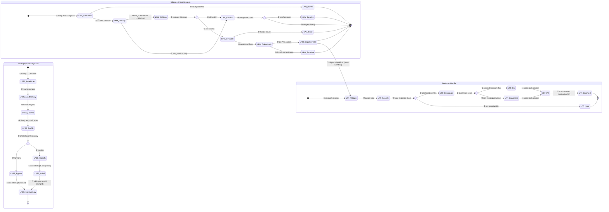
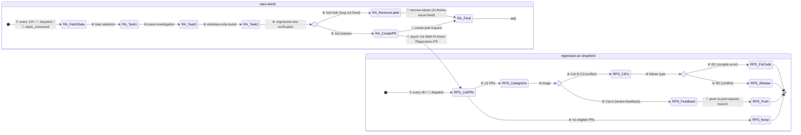

# dotnet/fsharp — Agentic State Machine

> **16 workflows documented.** Source: `.github/workflows/` · FULL_REWRITE (generator `f107bba1a1cd61dc`).

This document maps the 16 GitHub Actions workflows and AI agents in this repository — their triggers, control flow, side effects, and cross-workflow interactions. Audience: new engineers onboarding, PR reviewers, and automation auditors. Read top-down for context, or jump to the Handover Map for cross-workflow signals.

## Glossary

- **gh-aw** — GitHub CLI extension (`gh aw`) compiling agentic `.md` workflows (frontmatter + prompt) into `.lock.yml` GitHub Actions files.
- **safe-outputs** — gh-aw's permission/rate-limit framework constraining agent side effects per run (`max:`, `allowed-files:`, `labels:`).
- **noop** — Safe-output ending a run with no side effects. `report-as-issue: false` = silent no-op.
- **CCA (Copilot Coding Agent)** — Hosted coding agent invoked via `create-agent-session`.
- **state-store branch** — Git branch (e.g., `memory/repo-assist`, `safety/scanned-PRs`) for persistent JSON storage between runs.
- **flaky-test-detector** — Skill confirming flaky tests via ≥3 distinct PR failure evidence.
- **Cat A/B/C** (RPS) — Regression PR triage: A = review feedback, B = CI/conflict, C = healthy.
- **B0–B4** (RPS Cat B) — B0: conflict, B1: infra/flaky, B2: compile error, B3: bug NOT fixed, B4: other.
- **FCS** — F# Compiler Service (compiler-as-library for IDEs).
- **`.lock.yml`** — Compiled Actions YAML from `gh aw compile`; never hand-edited.

## Legend

| Prefix | Meaning |
|--------|---------|
| ⏰ | Cron/schedule trigger |
| 👤 | Human-initiated (PR, issue, comment, dispatch) |
| ⚙️ | Workflow engine (job condition, step logic, push) |
| 🤖 | Bot/agent action |
| `<<choice>>` | Binary branch (exactly 2 outgoing edges) |
| `<<fork>>`/`<<join>>` | Parallel execution (overlapping guards) |

## Overview

| # | Workflow | Trigger | Inputs | Primary Actions |
|---|---------|---------|--------|-----------------|
| 1 | `agentic-state-machine.md` | ⏰ weekly, 👤 dispatch | none | create-pull-request (.github/docs/**) |
| 2 | `aw-auto-update.md` | 👤 dispatch | none | noop or create-agent-session |
| 3 | `backport.yml` | 👤 issue_comment, ⏰ daily | none | reusable workflow (dotnet/arcade) |
| 4 | `branch-merge.yml` | ⚙️ push (release/*, main) | none | reusable workflow (dotnet/arcade) |
| 5 | `check_release_notes.yml` | 👤 pull_request_target | none | PR comment (release notes check) |
| 6 | `commands.yml` | 👤 issue_comment | none | run CLI, apply patch, comment |
| 7 | `copilot-setup-steps.yml` | 👤 dispatch | none | setup environment (checkout, build, tools) |
| 8 | `add_to_project.yml` | 👤 issues/PR opened | none | add label, set milestone, cleanup runs |
| 9 | `labelops-flake-fix.md` | 👤 dispatch | failing_test, affected_prs, originating_pr | create-pull-request, create-issue, add-comment |
| 10 | `labelops-pr-maintenance.md` | ⏰ every 3h, 👤 dispatch | none | push-to-PR, add-comment, add-labels, dispatch-workflow |
| 11 | `labelops-pr-security-scan.md` | ⏰ hourly, 👤 dispatch | none | add-labels, add-comment, repo-memory write |
| 12 | `msbuild-quality-review.md` | ⏰ weekly, 👤 dispatch | none | create-issue, create-pull-request (draft) |
| 13 | `regression-pr-shepherd.md` | ⏰ every 4h, 👤 dispatch | none | push-to-PR, add-comment, remove-labels |
| 14 | `repo-assist.md` | ⏰ every 12h, 👤 dispatch, 👤 slash_command | none | create-pull-request, add-comment, add/remove-labels, create/update-issue, push-to-PR |
| 15 | `repository_lockdown_check.yml` | 👤 pull_request_target | none | PR comment (lockdown warning) |
| 16 | `skill-validation.yml` | 👤 PR, ⚙️ push (main), 👤 dispatch | none | validate skills/agents |

## Handover Map

Cross-workflow interactions (producer → consumer):

| Signal | Producer | Consumer | Mechanism |
|--------|----------|----------|-----------|
| `AI-Auto-Resolve-CI/Conflicts` labels | Human maintainer | `labelops-pr-maintenance` | Label filter on PR list |
| `AI-Issue-Regression-PR` label | `repo-assist` | `regression-pr-shepherd` | Label filter on PR list |
| `AI-thinks-issue-fixed` label | `repo-assist` | `regression-pr-shepherd` (remove) | Label on linked issue |
| `dispatch-workflow: labelops-flake-fix` | `labelops-pr-maintenance` | `labelops-flake-fix` | workflow_dispatch with inputs |
| `Flaky` label | `labelops-flake-fix` | Human triage | always-applied on PR/issue |
| `AI-needs-CI-fix-input` label | `labelops-pr-maintenance` | Human maintainer | escalation signal |
| `⚠️ Affects-*` labels | `labelops-pr-security-scan` | Human reviewer | informational |
| `Needs-Triage` label | `add_to_project.yml` | Human triage | imperative on new issues |
| State-store `safety/scanned-PRs` | `labelops-pr-security-scan` | `labelops-pr-security-scan` | repo-memory persistence |
| State-store `memory/repo-assist` | `repo-assist` | `repo-assist` | repo-memory persistence |

## Group A — LabelOps Ecosystem

Workflows: `labelops-pr-maintenance` (LPM), `labelops-flake-fix` (LFF), `labelops-pr-security-scan` (LPSS).

LPM dispatches LFF when proven flakes are detected. LPSS operates independently on a separate schedule scanning fork PRs.

## Group B — Regression Test Pipeline

Workflows: `repo-assist` (RA), `regression-pr-shepherd` (RPS).

RA creates regression test PRs and labels issues. RPS shepherds those PRs to merge.

## Group C — Traditional Workflows (PR Lifecycle)

Workflows triggered by PRs/issues: `check_release_notes`, `repository_lockdown_check`, `add_to_project`, `commands`, `backport`.

```mermaid
stateDiagram-v2
  direction LR

  state "check_release_notes" as CRN {
    [*] --> CRN_GetPR : 👤 pull_request_target (main, release/*)
    CRN_GetPR --> CRN_CheckPaths : ⚙️ checkout PR ref
    state CRN_Result <<choice>>
    CRN_CheckPaths --> CRN_Result : ⚙️ check modified paths vs release notes
    CRN_Result --> CRN_Pass : ⚙️ notes present OR NO_RELEASE_NOTES label
    CRN_Result --> CRN_Fail : ⚙️ notes missing
    CRN_Pass --> CRN_Comment : ⚙️ if: success() || failure()
    CRN_Fail --> CRN_Comment : ⚙️ if: success() || failure()
    CRN_Comment --> [*]
  }

  state "repository_lockdown_check" as RLC {
    [*] --> RLC_Check : 👤 pull_request_target (main, release/*)
    state RLC_Locked <<choice>>
    RLC_Check --> RLC_Locked : ⚙️ if: vars.LOCKDOWN == true
    RLC_Locked --> RLC_Warn : ⚙️ true (lockdown active)
    RLC_Locked --> RLC_Clean : ⚙️ false (no lockdown)
    RLC_Warn --> [*]
    RLC_Clean --> [*]
  }

  state "add_to_project" as ATP {
    [*] --> ATP_Entry : 👤 issues (opened, transferred)
    state ATP_IsPR <<choice>>
    [*] --> ATP_IsPR : 👤 pull_request_target (main, opened)
    ATP_IsPR --> ATP_Entry : ⚙️ event != pull_request_target
    ATP_IsPR --> [*] : ⚙️ event == pull_request_target (jobs gated off)
    state ATP_Fork <<fork>>
    state ATP_Join <<join>>
    ATP_Entry --> ATP_Fork : ⚙️ if: event != pull_request_target
    ATP_Fork --> ATP_Label : 🤖 add Needs-Triage
    ATP_Fork --> ATP_Milestone : 🤖 set milestone 29
    ATP_Fork --> ATP_Cleanup : 🤖 delete old workflow runs
    ATP_Label --> ATP_Join
    ATP_Milestone --> ATP_Join
    ATP_Cleanup --> ATP_Join
    ATP_Join --> [*]
  }

  state "commands" as CMD {
    [*] --> CMD_Auth : 👤 issue_comment (created)
    state CMD_Allowed <<choice>>
    CMD_Auth --> CMD_Allowed : ⚙️ check write access
    CMD_Allowed --> [*] : ⚙️ not allowed
    CMD_Allowed --> CMD_Parse : ⚙️ allowed + is PR
    CMD_Parse --> CMD_Run : ⚙️ command matched
    CMD_Run --> CMD_Apply : ⚙️ patch + validate paths
    CMD_Apply --> CMD_Report : 🤖 push + comment
    CMD_Report --> [*]
  }

  state "backport" as BP {
    [*] --> BP_Entry : 👤 issue_comment / ⏰ daily cron
    state BP_Guard <<choice>>
    BP_Entry --> BP_Guard : ⚙️ if: contains(body, '/backport to') OR schedule
    BP_Guard --> BP_Run : ⚙️ true
    BP_Guard --> [*] : ⚙️ false
    BP_Run --> [*]
  }
```

## Group D — Infrastructure & Maintenance

Workflows: `branch-merge`, `copilot-setup-steps`, `skill-validation`, `agentic-state-machine`, `aw-auto-update`, `msbuild-quality-review`.

```mermaid
stateDiagram-v2
  direction LR

  state "branch-merge" as BM {
    [*] --> BM_Run : ⚙️ push (release/*, main)
    BM_Run --> [*]
  }

  state "copilot-setup-steps" as CSS {
    [*] --> CSS_Setup : 👤 dispatch
    CSS_Setup --> [*]
  }

  state "skill-validation" as SV {
    [*] --> SV_Validate : 👤 PR / ⚙️ push (main) / 👤 dispatch
    SV_Validate --> [*]
  }

  state "agentic-state-machine" as ASM {
    [*] --> ASM_Generate : ⏰ weekly / 👤 dispatch
    state ASM_Changed <<choice>>
    ASM_Generate --> ASM_Changed : ⚙️ doc differs from source
    ASM_Changed --> ASM_PR : 🤖 create-pull-request
    ASM_Changed --> ASM_Noop : ⚙️ no changes
    ASM_PR --> [*]
    ASM_Noop --> [*]
  }

  state "aw-auto-update" as AWU {
    [*] --> AWU_Install : 👤 dispatch
    AWU_Install --> AWU_Upgrade : ⚙️ gh aw upgrade
    AWU_Upgrade --> AWU_Compile : ⚙️ gh aw compile
    AWU_Compile --> AWU_Diff : ⚙️ capture diff
    state AWU_HasChanges <<choice>>
    AWU_Diff --> AWU_HasChanges : ⚙️ check CHANGED_FILES
    AWU_HasChanges --> AWU_Dedup : ⚙️ changes detected
    AWU_HasChanges --> AWU_Noop : ⚙️ no changes
    state AWU_DedupResult <<choice>>
    AWU_Dedup --> AWU_DedupResult : ⚙️ search open PR/issue
    AWU_DedupResult --> AWU_Noop : ⚙️ existing PR/issue found
    AWU_DedupResult --> AWU_Delegate : ⚙️ no duplicate
    AWU_Delegate --> [*]
    AWU_Noop --> [*]
  }

  state "msbuild-quality-review" as MQR {
    [*] --> MQR_Discover : ⏰ weekly / 👤 dispatch
    MQR_Discover --> MQR_Review : ⚙️ scan MSBuild files
    MQR_Review --> MQR_Classify : ⚙️ apply rules A-E
    state MQR_HasFindings <<choice>>
    MQR_Classify --> MQR_HasFindings : ⚙️ check for issues
    MQR_HasFindings --> MQR_Issue : 🤖 create-issue
    MQR_HasFindings --> MQR_Noop : ⚙️ no new findings
    MQR_Issue --> MQR_Fix : 🤖 create-pull-request (draft, safe fixes)
    MQR_Fix --> [*]
    MQR_Noop --> [*]
  }
```

## Safe-Output Signatures

gh-aw safe-output defaults (suppressed below): `target: "*"`, `noop.report-as-issue: false`, `draft: false`.

| Workflow | Output | Max | Key Constraints |
|----------|--------|-----|-----------------|
| `agentic-state-machine` | `create-pull-request` | 1 | title `[Agentic State Machine] `, allowed-files `.github/docs/**` |
| `aw-auto-update` | `create-agent-session` | 1 | base: main |
| `labelops-flake-fix` | `create-pull-request` | 1 | title `[LabelOps Flake] `, labels: automation+Flaky+NO_RELEASE_NOTES, protected-files: fallback-to-issue |
| `labelops-flake-fix` | `create-issue` | 1 | title `[LabelOps Flake] `, labels: Flaky+automation |
| `labelops-flake-fix` | `add-comment` | 1 | — |
| `labelops-pr-maintenance` | `push-to-pull-request-branch` | 5 | protected-files: allowed |
| `labelops-pr-maintenance` | `add-comment` | 5 | hide-older-comments: true |
| `labelops-pr-maintenance` | `add-labels` | 3 | allowed: AI-needs-CI-fix-input |
| `labelops-pr-maintenance` | `dispatch-workflow` | 3 | workflows: labelops-flake-fix |
| `labelops-pr-security-scan` | `add-labels` | 50 | allowed: 10 labels (⚠️ Affects-* family + Scanned-Clean + Bypassed) |
| `labelops-pr-security-scan` | `add-comment` | 25 | hide-older-comments: true |
| `msbuild-quality-review` | `create-issue` | 1 | title `[msbuild-quality] `, labels: automation+Area-ProjectsAndBuild |
| `msbuild-quality-review` | `create-pull-request` | 1 | draft: true, title `[msbuild-quality] `, protected-files: fallback-to-issue |
| `regression-pr-shepherd` | `push-to-pull-request-branch` | 10 | allowed-files: tests/**, vsintegration/tests/** |
| `regression-pr-shepherd` | `add-comment` | 5 | hide-older-comments: true |
| `regression-pr-shepherd` | `remove-labels` | 5 | allowed: AI-thinks-issue-fixed |
| `repo-assist` | `create-pull-request` | 10 | title `Add regression test: `, labels: NO_RELEASE_NOTES+AI-Issue-Regression-PR, reviewers: abonie+T-Gro, auto-merge: true |
| `repo-assist` | `add-comment` | 10 | hide-older-comments: true |
| `repo-assist` | `add-labels` | 30 | allowed: AI-thinks-issue-fixed, AI-thinks-windows-only |
| `repo-assist` | `remove-labels` | 10 | allowed: AI-thinks-issue-fixed, AI-thinks-windows-only |
| `repo-assist` | `create-issue` | 4 | title `[Repo Assist] `, labels: automation+repo-assist |
| `repo-assist` | `push-to-pull-request-branch` | 4 | title `[Repo Assist] `, protected-files: fallback-to-issue |

## Label Index

| Label | Type | Added by | Removed by | Read by | Notes |
|-------|------|----------|------------|---------|-------|
| `Needs-Triage` | imperative | add_to_project | Human | Human | Applied to new issues |
| `NO_RELEASE_NOTES` | filter | Human | — | check_release_notes | Opts out of release notes check |
| `AI-Auto-Resolve-CI` | filter | Human | — | LPM | Opts PR into CI auto-fix |
| `AI-Auto-Resolve-Conflicts` | filter | Human | — | LPM | Opts PR into conflict auto-resolve |
| `AI-needs-CI-fix-input` | agent-add | LPM | Human | LPM (ci_blocked) | Escalation when CI unfixable |
| `AI-Issue-Regression-PR` | always-applied | RA (on PR) | — | RPS | Links regression test PRs |
| `AI-thinks-issue-fixed` | agent-add + agent-remove | RA | RA, RPS | RA (Task 2) | Issue believed fixed |
| `AI-thinks-windows-only` | agent-add + agent-remove | RA | RA | RA (Task 3) | Issue believed VS-only |
| `Flaky` | always-applied | LFF | — | Human | Marks flaky test PR/issue |
| `automation` | always-applied | LFF, MQR, RA | — | Human | Generic automation tag |
| `AI-Tooling-Check-Scanned-Clean` | agent-add | LPSS | — | Human | Fork PR scanned, no flags |
| `AI-Tooling-Check-Bypassed` | agent-add | LPSS | — | Human | Non-fork PR bypassed |
| `⚠️ Affects-*` family (7 labels) | agent-add | LPSS | — | Human | Build-Infra, Compiler-Output, Bootstrap, Restore, Design-Time, Test-Tooling, Agent-Config |
| `⚠️ Suspicious-Prompting` | agent-add | LPSS | — | Human | Prompt injection detected |
| `⚠️ Scope-Review-Needed` | agent-add | LPSS | — | Human | PR scope exceeds stated purpose |
| `repo-assist` | always-applied | RA | — | Human | Tags RA-created issues |
| `Area-ProjectsAndBuild` | always-applied | MQR | — | Human | Tags MSBuild quality issues |

---

> generator-version: f107bba1a1cd61dc · source-shas: 06e56c52,149f0bbe,1af951a0,36b2b857,3775b51d,49b2989b,5e54b0e6,5e9a1344,7dca5b8f,9285c8a0,98d92f32,a5296399,acf12bdf,b5c04ea8,ec5fa486,f107bba1,
