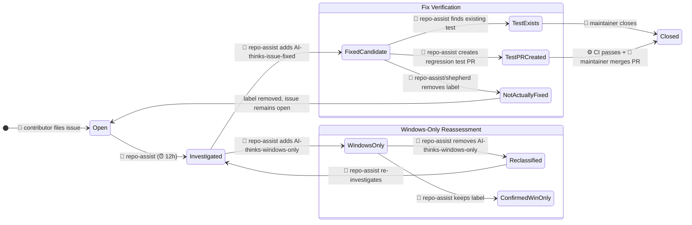
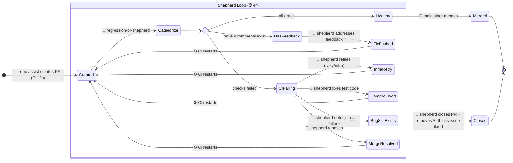
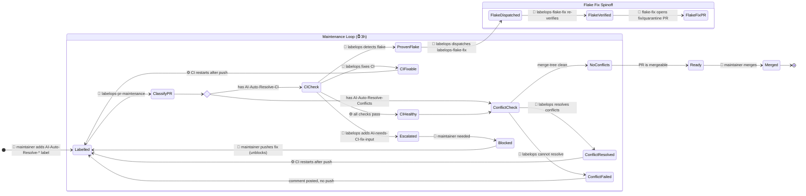
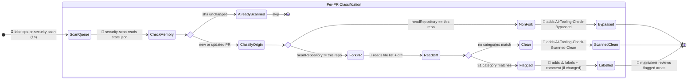
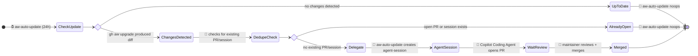

# Agentic Workflow State Machine

Auto-generated documentation of all agentic workflows in this repository.

## Workflow Overview

| Workflow | Trigger | Reads | Writes | Key Labels |
|----------|---------|-------|--------|------------|
| **repo-assist** | ⏰ every 12h, `/repo-assist` | Issues, PRs, code, tests | comment, PR, issue, labels | `AI-thinks-issue-fixed`, `AI-thinks-windows-only`, `AI-Issue-Regression-PR` |
| **labelops-pr-maintenance** | ⏰ every 3h | PRs with AI-Auto-Resolve-* labels, CI status | comment, push, labels, dispatch | `AI-Auto-Resolve-CI`, `AI-Auto-Resolve-Conflicts`, `AI-needs-CI-fix-input` |
| **regression-pr-shepherd** | ⏰ every 4h | PRs with `AI-Issue-Regression-PR` | comment, push, remove-labels | `AI-Issue-Regression-PR`, `AI-thinks-issue-fixed` |
| **labelops-flake-fix** | 🤖 dispatched by labelops-pr-maintenance | Test results, PR diffs | PR, comment, issue | `Flaky`, `automation` |
| **labelops-pr-security-scan** | ⏰ every 1h | PR diffs, file lists | labels, comment | `AI-Tooling-Check-Scanned-Clean`, `AI-Tooling-Check-Bypassed`, `⚠️ Affects-*`, `⚠️ Suspicious-Prompting`, `⚠️ Scope-Review-Needed` |
| **aw-auto-update** | ⏰ every 24h | `.github/workflows/*` files | agent-session | `automation` |

## Issue Lifecycle

## Regression Test PR Lifecycle

## PR Maintenance Lifecycle

## PR Security Scan Lifecycle

## Infrastructure Lifecycle

## Label Dictionary

| Label | Applied By | Read By | Meaning |
|-------|-----------|---------|---------|
| `AI-thinks-issue-fixed` | 🤖 repo-assist | 🤖 repo-assist, 🤖 regression-pr-shepherd | Issue appears fixed; needs regression test verification |
| `AI-thinks-windows-only` | 🤖 repo-assist | 🤖 repo-assist | Issue requires Windows/VS to reproduce (may be reassessed) |
| `AI-Auto-Resolve-CI` | 👤 maintainer | 🤖 labelops-pr-maintenance | Opt-in: agent should fix CI failures on this PR |
| `AI-Auto-Resolve-Conflicts` | 👤 maintainer | 🤖 labelops-pr-maintenance | Opt-in: agent should resolve merge conflicts on this PR |
| `AI-needs-CI-fix-input` | 🤖 labelops-pr-maintenance | 🤖 labelops-pr-maintenance, 👤 maintainer | CI failure requires human intervention |
| `AI-Issue-Regression-PR` | 🤖 repo-assist | 🤖 regression-pr-shepherd, 🤖 labelops-pr-maintenance (exclude) | PR is a regression test created by repo-assist |
| `Flaky` | 🤖 labelops-flake-fix | 👤 maintainer | Test identified as non-deterministic |
| `AI-Tooling-Check-Scanned-Clean` | 🤖 labelops-pr-security-scan | 👤 maintainer | Fork PR scanned, no safety concerns found |
| `AI-Tooling-Check-Bypassed` | 🤖 labelops-pr-security-scan | 👤 maintainer | Non-fork PR, scan bypassed (trusted origin) |
| `⚠️ Affects-Build-Infra` | 🤖 labelops-pr-security-scan | 👤 maintainer | PR modifies build infrastructure |
| `⚠️ Affects-Compiler-Output` | 🤖 labelops-pr-security-scan | 👤 maintainer | PR affects compiler output |
| `⚠️ Affects-Bootstrap` | 🤖 labelops-pr-security-scan | 👤 maintainer | PR affects bootstrap process |
| `⚠️ Affects-Restore` | 🤖 labelops-pr-security-scan | 👤 maintainer | PR modifies restore/package resolution |
| `⚠️ Affects-Design-Time` | 🤖 labelops-pr-security-scan | 👤 maintainer | PR affects design-time behavior |
| `⚠️ Affects-Test-Tooling` | 🤖 labelops-pr-security-scan | 👤 maintainer | PR modifies test tooling |
| `⚠️ Affects-Agent-Config` | 🤖 labelops-pr-security-scan | 👤 maintainer | PR modifies AI agent configuration |
| `⚠️ Suspicious-Prompting` | 🤖 labelops-pr-security-scan | 👤 maintainer | PR contains prompt injection patterns |
| `⚠️ Scope-Review-Needed` | 🤖 labelops-pr-security-scan | 👤 maintainer | PR diff exceeds stated scope |
| `automation` | 🤖 aw-auto-update, 🤖 labelops-flake-fix | 👤 maintainer | PR was created by automation |
| `NO_RELEASE_NOTES` | 🤖 repo-assist, 🤖 labelops-flake-fix | ⚙️ CI | PR does not need release notes entry |
| `repo-assist` | 🤖 repo-assist | 🤖 repo-assist | Issue is managed by repo-assist (monthly summary) |

## Handover Map

| From | To | Trigger | Mechanism |
|------|----|---------|-----------|
| 🤖 repo-assist | 🤖 regression-pr-shepherd | PR created with `AI-Issue-Regression-PR` label | Label-based pickup (⏰ 4h) |
| 🤖 labelops-pr-maintenance | 🤖 labelops-flake-fix | Proven flake detected (≥3 PRs) | `dispatch-workflow` |
| 🤖 regression-pr-shepherd | 👤 maintainer | PR is healthy (CI green, no feedback) | PR ready for review |
| 🤖 regression-pr-shepherd | 👤 maintainer | Bug still exists (Category B3) | Comment + close PR + remove label |
| 🤖 labelops-pr-maintenance | 👤 maintainer | CI unfixable | `AI-needs-CI-fix-input` label + escalation comment |
| 👤 maintainer | 🤖 labelops-pr-maintenance | Adds `AI-Auto-Resolve-*` label to PR | Label-based pickup (⏰ 3h) |
| 👤 maintainer | 🤖 repo-assist | `/repo-assist <instructions>` | Slash command |
| ⏰ scheduler | 🤖 repo-assist | Every 12h | Cron schedule |
| ⏰ scheduler | 🤖 labelops-pr-maintenance | Every 3h | Cron schedule |
| ⏰ scheduler | 🤖 regression-pr-shepherd | Every 4h | Cron schedule |
| ⏰ scheduler | 🤖 labelops-pr-security-scan | Every 1h | Cron schedule |
| ⏰ scheduler | 🤖 aw-auto-update | Every 24h | Cron schedule |
| 🤖 aw-auto-update | 🤖 Copilot Coding Agent | Changes detected | `create-agent-session` safe output |
| 🤖 repo-assist | 🤖 repo-assist | Own PR has CI failure or conflicts | `push-to-pull-request-branch` (self-heal) |
| 🤖 labelops-flake-fix | 🤖 labelops-pr-maintenance | Fix PR created | Originating PR comment posted |

<!-- source-hashes:
aw-auto-update.md: da8c5e340a43d73616e3a0203c7e56de9ca4b82ee78b1902afe466a49a08bc17
labelops-flake-fix.md: 7dca5b8faa60f947204f8925c6238fbecf42aa8cbf3144a166120501b0eef1e4
labelops-pr-maintenance.md: 59ba52fc625e0b9112c31864e92154cdf09acf0bc0f2b167aa30a0d76baa898f
labelops-pr-security-scan.md: 4e0ee1ccd6212be30f8ccd334ecbc47123655e2507b5968c1bf2c1678a1ed306
regression-pr-shepherd.md: 18a65fe1cdf8aa219158f1d610db14078e5ff2f1ac912df2566bf796792395b5
repo-assist.md: 3775b51d142d22c98e87e48e8ac9d46cdf69e9c8306d5787758a35578dcb1119
-->
