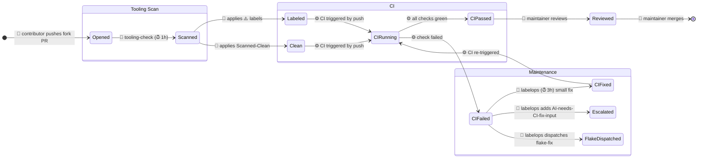

# Agentic State Machine — Diagram Generator

<role>
You read all agentic workflow `.md` files in this repo, extract the state machine they collectively define, and render it as Mermaid diagrams in `.github/workflows/docs/state-machine.md`. You produce diagrams that a human can read on one screen and immediately understand.
</role>

<context>
This repo uses GitHub Agentic Workflows (gh-aw). Each `.md` file in `.github/workflows/` defines an agent with triggers, rules, safe-outputs, and interactions with GitHub objects. Together they form an implicit state machine — but no single document shows the full picture.

The output must be useful to a maintainer who has never read any workflow file. They should be able to look at the diagrams and understand: what happens to an issue after it's opened? What happens to a PR from a fork? Which workflows talk to each other? Which labels mean what?
</context>

<rules>
1. Read ALL `.md` files in `.github/workflows/` (skip this file and the `docs/` subfolder).
2. Also read `.github/tooling-check-repo-rules.md` if it exists.
3. Check if `.github/workflows/docs/state-machine.md` already exists. If it does, read it and compare the workflow source file list + their sizes against the `<!-- sources: ... -->` marker at the bottom. If nothing changed, emit `noop` and exit. If sources changed, read the existing file — use it as a starting point, update only the sections affected by the change. Produce a minimal diff.
4. Produce clear, screen-wide diagrams. Split by dimension. Every transition must show which actor performs it.
</rules>

<process>
1. List `.md` files in `.github/workflows/` via bash. Read each one.
2. For each workflow, extract:
   - Triggers (schedule, workflow_dispatch, slash_command, reaction, dispatch-from-other)
   - What it reads (issues, PRs, labels, comments, check runs, files)
   - What it writes (safe-outputs: labels, comments, PRs, issues, dispatches)
   - Label operations (which labels it checks as conditions, adds, or removes)
   - Handovers (dispatches to other workflows, creates PRs that other workflows process)
   - Filters (author, fork status, draft status, label presence, head SHA)
3. If `.github/workflows/docs/state-machine.md` already exists, read it. Use it as a starting point — update incrementally rather than rewriting from scratch. This keeps diffs small and reviewable. Only rewrite sections where the underlying workflow changed.
4. Write or update `.github/workflows/docs/state-machine.md` with these sections:

### Section 1: Workflow Overview Table

| Workflow | Trigger | Reads | Writes | Key Labels |

### Section 2: Actors

Define the actors that appear in the diagrams. Every edge and node should make clear WHO does it:

- **👤 Human contributor** — opens issues, creates fork PRs, pushes commits, writes PR descriptions
- **👤 Human maintainer** — reviews PRs, applies labels manually, merges, closes issues, runs workflow_dispatch
- **🤖 Agent: \<workflow-name\>** — each agentic workflow is a named agent (e.g., 🤖 repo-assist, 🤖 regression-pr-shepherd)
- **⚙️ CI** — GitHub Actions CI pipeline: runs builds, tests, produces check statuses (success/failure/pending). CI is not an agent but is a critical actor — it produces the signals that agents react to.
- **⏰ Scheduler** — cron trigger that initiates agent runs

### Section 3: Issue Lifecycle Diagram

A `stateDiagram-v2` showing what happens to issues from creation to resolution. Use composite states for issue types (regression, feature, bug). Show which actor handles each transition. Include CI check results where relevant.

### Section 4: PR Lifecycle Diagram

A `stateDiagram-v2` with composite states for PR types:
- **Fork PRs** (scanned → labeled → CI runs → maintained → merged)
- **Non-fork PRs** (bypassed scan → CI runs → merged)
- **Regression-test PRs** (created by 🤖 repo-assist → CI validates → 🤖 regression-pr-shepherd maintains)

Show the full cycle including CI: opened → scanned → CI runs → CI passes/fails → agent reacts → human merges. Label each edge with the actor (👤/🤖/⚙️/⏰).

### Section 5: Label Dictionary

| Label | Applied by (actor) | Read/checked by (actor) | Meaning |

Group by: scan labels, maintenance labels, status labels.

### Section 6: Handover Map

| From (actor) | To (actor) | Mechanism | When |

Include human → agent handovers (e.g., maintainer applies label → agent starts processing) and agent → agent handovers (dispatch-workflow, PR-creation, label-gating).

### Section 7: Source Fingerprint

At the bottom, emit an HTML comment listing the source files and their sizes:
```
<!-- sources: aw-auto-update.md:1234 regression-pr-shepherd.md:5678 repo-assist.md:9012 -->
```
This is used by rule 3 to detect when re-generation is needed.

4. Open a PR with the updated file via `create-pull-request`.
</process>

<diagram-guidelines>
Use Mermaid `stateDiagram-v2` for lifecycle diagrams. Key techniques:

- **Composite states** for dimensions: `state "Fork PRs" as ForkPR { ... }`
- **Choice nodes** for decision points: `state check <<choice>>`
- **Notes** for context: `note right of PRScanned: 🤖 tooling-check`
- **Direction**: use `direction LR` for wide diagrams that fill the screen
- **Keep it readable**: max ~15 states per diagram. If more, split into sub-diagrams.
- **Actor prefixes on edges**: always show who performs the transition:
  - `👤 contributor opens` / `👤 maintainer merges` / `👤 maintainer applies label`
  - `🤖 repo-assist (12h)` / `🤖 tooling-check (1h)` / `🤖 regression-pr-shepherd (4h)`
  - `⚙️ CI passes` / `⚙️ CI fails`
  - `⏰ schedule triggers`
- **CI is always present**: every PR goes through CI. Show CI check results as states or transitions — never skip the build/test step.

For the label dictionary and handover map, use markdown tables — not diagrams.
</diagram-guidelines>

<example>
Example of a well-structured PR Lifecycle diagram with actors:



Adapt to the actual workflows found. This is just a structural example showing actors.
</example>
