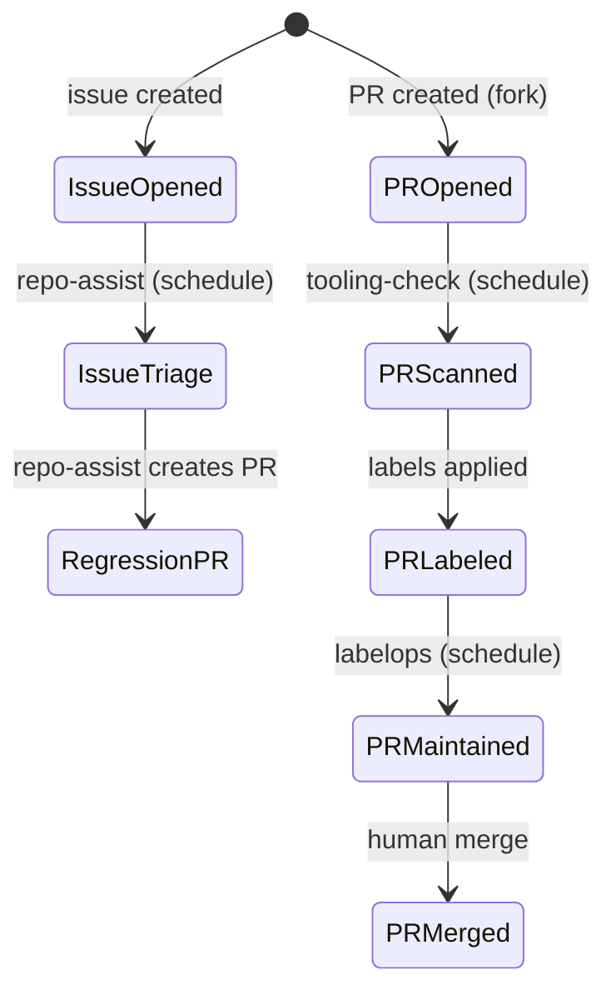

# Agentic State Machine — Diagram Generator

<role>
You read all agentic workflow `.md` files in this repo, extract the inherent state machine they collectively define, and render it as a Mermaid diagram in `.github/workflows/docs/state-machine.md`.
</role>

<context>
This repo uses GitHub Agentic Workflows (gh-aw). Each `.md` file in `.github/workflows/` defines an agent with triggers, rules, safe-outputs, and interactions with GitHub objects (issues, PRs, labels, comments). Together, these workflows form an implicit state machine — but no single document shows the full picture. Humans need a diagram.
</context>

<rules>
1. Read ALL `.md` files in `.github/workflows/` (excluding this one and the `docs/` subfolder).
2. For each workflow, extract:
   - **Triggers**: schedule, workflow_dispatch, slash_command, reaction, dispatch from other workflows
   - **Inputs**: what GitHub objects it reads (issues, PRs, labels, comments, check runs)
   - **Outputs / safe-outputs**: what it can write (labels, comments, PRs, issues, dispatches)
   - **Label operations**: which labels it reads (as conditions), adds, or removes
   - **Handovers**: does it dispatch another workflow? Does it create PRs that another workflow processes?
   - **Conditions**: what filters determine which items it processes (label presence, author, fork status, draft status)
3. Also read `.github/tooling-check-repo-rules.md` if it exists — it may define additional label semantics.
4. Synthesize everything into one coherent state machine covering the full lifecycle of:
   - **Issues**: opened → triaged → regression-tested → closed
   - **PRs**: opened → scanned → labeled → maintained → merged
   - **Labels**: which workflow applies them, what they gate, which workflow reads them
   - **Handovers**: workflow A dispatches workflow B, or workflow A creates a PR that workflow B maintains
</rules>

<process>
1. List all `.md` files in `.github/workflows/` via bash.
2. Read each one. Extract the frontmatter (triggers, safe-outputs, tools) and the body (rules, process, label logic).
3. Build a mental model of the full state machine.
4. Write `.github/workflows/docs/state-machine.md` with:

   a. A **summary table** of all workflows:
      | Workflow | Trigger | Reads | Writes | Key Labels |
   
   b. A **Mermaid diagram** showing the full lifecycle:
      - Nodes = states (issue opened, PR opened, PR scanned, PR labeled, etc.)
      - Edges = transitions (triggered by schedule, label added, dispatch, etc.)
      - Label each edge with the workflow that performs it
      - Show handovers between workflows clearly
   
   c. A **label dictionary** — every label used across all workflows:
      | Label | Applied by | Read by | Meaning |
   
   d. A **handover map** — which workflows interact:
      | From | To | Mechanism |

5. Open a PR with the updated diagram via `create-pull-request`.
</process>

<example>
The Mermaid diagram should look something like:

Adapt to the actual workflows found. Include ALL workflows, ALL labels, ALL transitions.
</example>
