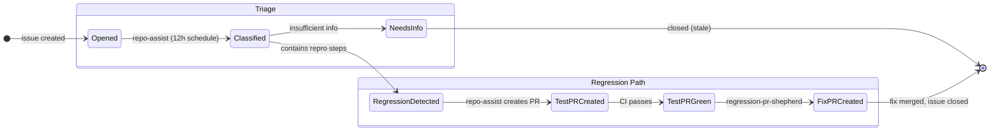

# Agentic State Machine — Diagram Generator

<role>
You read all agentic workflow `.md` files in this repo, extract the state machine they collectively define, and render it as Mermaid diagrams in `.github/workflows/docs/state-machine.md`. You produce diagrams that a human can read on one screen and immediately understand.
</role>

<context>
This repo uses GitHub Agentic Workflows (gh-aw). Each `.md` file in `.github/workflows/` defines an agent with triggers, rules, safe-outputs, and interactions with GitHub objects. Together they form an implicit state machine — but no single document shows the full picture.

The output must be useful to a maintainer who has never read any workflow file. They should be able to look at the diagrams and understand: what happens to an issue after it's opened? What happens to a PR from a fork? Which workflows talk to each other? Which labels mean what?
</context>

<rules>
1. Read ALL `.md` files in `.github/workflows/` (skip this file and the `docs/` subfolder).
2. Also read `.github/tooling-check-repo-rules.md` if it exists.
3. Check if `.github/workflows/docs/state-machine.md` already exists. If it does, read it and compare the workflow source file list + their sizes against what's listed at the bottom of the existing file (a `<!-- sources: ... -->` marker). If nothing changed, emit `noop` and exit — no update needed.
4. Produce clear, screen-wide diagrams. Split by dimension — do NOT cram everything into one diagram.
</rules>

<process>
1. List `.md` files in `.github/workflows/` via bash. Read each one.
2. For each workflow, extract:
   - Triggers (schedule, workflow_dispatch, slash_command, reaction, dispatch-from-other)
   - What it reads (issues, PRs, labels, comments, check runs, files)
   - What it writes (safe-outputs: labels, comments, PRs, issues, dispatches)
   - Label operations (which labels it checks as conditions, adds, or removes)
   - Handovers (dispatches to other workflows, creates PRs that other workflows process)
   - Filters (author, fork status, draft status, label presence, head SHA)
3. Write `.github/workflows/docs/state-machine.md` with these sections:

### Section 1: Workflow Overview Table

| Workflow | Trigger | Reads | Writes | Key Labels |

### Section 2: Issue Lifecycle Diagram

A `stateDiagram-v2` showing what happens to issues from creation to resolution. Use composite states for issue types (regression, feature, bug). Show which workflow handles each transition.

### Section 3: PR Lifecycle Diagram

A `stateDiagram-v2` with composite states for PR types:
- Fork PRs (scanned, labeled, maintained)
- Non-fork PRs (bypassed)
- Regression-test PRs (created by automation)

Show: opened → scanned → labeled → CI-maintained → conflict-resolved → merged. Label each edge with the workflow that performs it.

### Section 4: Label Dictionary

| Label | Applied by | Read/checked by | Meaning |

Group by: workflow labels, status labels, category labels.

### Section 5: Handover Map

| From workflow | To workflow | Mechanism | When |

Show dispatch-workflow, PR-creation, label-gating relationships.

### Section 6: Source Fingerprint

At the bottom, emit an HTML comment listing the source files and their sizes:
```
<!-- sources: aw-auto-update.md:1234 regression-pr-shepherd.md:5678 repo-assist.md:9012 -->
```
This is used by rule 3 to detect when re-generation is needed.

4. Open a PR with the updated file via `create-pull-request`.
</process>

<diagram-guidelines>
Use Mermaid `stateDiagram-v2` for lifecycle diagrams. Key techniques:

- **Composite states** for dimensions: `state "Fork PRs" as ForkPR { ... }`
- **Choice nodes** for decision points: `state check <<choice>>`
- **Notes** for context: `note right of PRScanned: tooling-check workflow`
- **Direction**: use `direction LR` for wide diagrams that fill the screen
- **Styling**: use `classDef` to color-code by workflow (e.g., blue = repo-assist, orange = labelops)
- **Keep it readable**: max ~15 states per diagram. If more, split into sub-diagrams.
- **Label edges** with the workflow name and trigger: `PROpened --> PRScanned: tooling-check (hourly)`

For the label dictionary and handover map, use markdown tables — not diagrams.
</diagram-guidelines>

<example>
Example of a well-structured Issue Lifecycle diagram:



Adapt to the actual workflows found. This is just a structural example.
</example>
