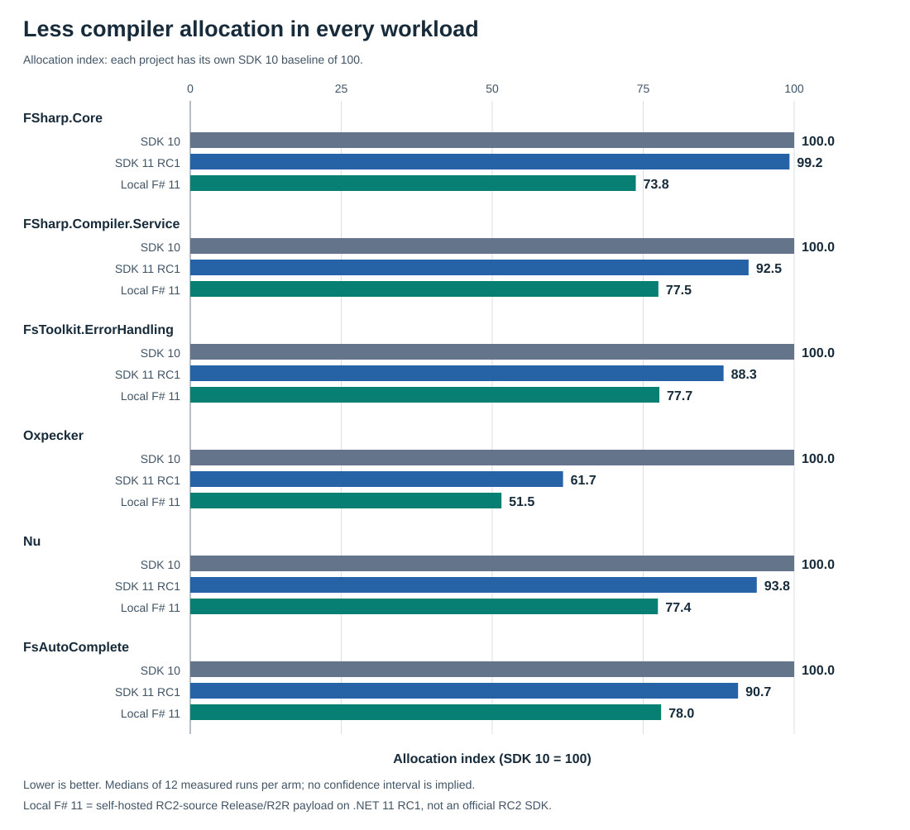
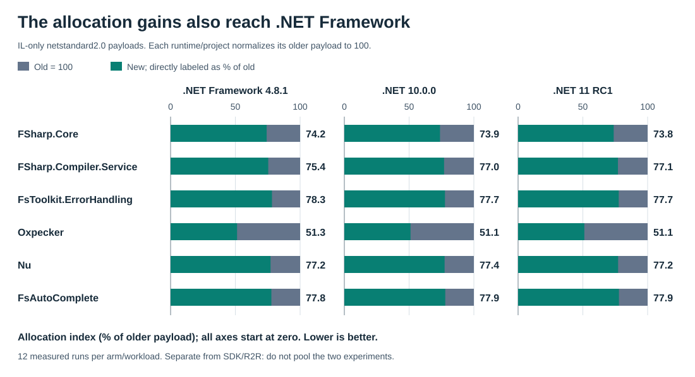
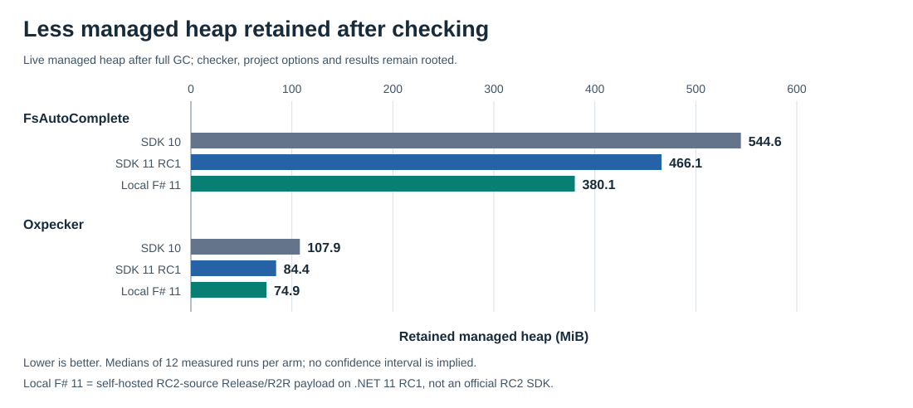

# Performance improvements in the F# 11 compiler

The clearest improvement is **less allocation**, both while compiling F# and in some of the programs the compiler produces. The compilation comparison includes all six measured projects.

<!-- generated:compilation -->
| Compilation workload | SDK 10 GiB | SDK 11 RC1 GiB | Local F# 11 GiB | Less vs SDK 10 | Less vs RC1 |
| --- | ---: | ---: | ---: | ---: | ---: |
| FSharp.Core | 7.569 | 7.510 | 5.584 | 26.2% | 25.7% |
| FSharp.Compiler.Service | 35.203 | 32.546 | 27.288 | 22.5% | 16.2% |
| FsToolkit.ErrorHandling | 2.214 | 1.955 | 1.720 | 22.3% | 12.0% |
| Oxpecker | 1.145 | 0.707 | 0.590 | 48.5% | 16.5% |
| Nu | 14.764 | 13.850 | 11.433 | 22.6% | 17.4% |
| FsAutoComplete | 5.828 | 5.287 | 4.544 | 22.0% | 14.0% |
<!-- /generated:compilation -->

**Allocated GiB** is cumulative managed allocation during one compilation, not the amount of RAM needed at once. Each cell is the median of 12 fresh-process runs. Reductions compare the unrounded arm medians: the difference divided by the named older baseline. They are not the medians of paired ratios used in the [detailed statistical tables](../third-wave/article.md#the-improvement-and-the-limits).

<!-- generated:headline -->
Across all six workloads, the local F# 11 payload allocates **22.0%-48.5% less than SDK 10**, and **12.0%-25.7% less than RC1**. The later changes matter: RC1 is not the endpoint of this work.
<!-- /generated:headline -->

The three columns represent SDK **10.0.100 on .NET 10.0.0**, SDK **11.0.100-rc.1.26425.128 on its exact .NET 11 RC1 runtime**, and a **local, self-hosted Release/ReadyToRun build from the pinned VMR RC2 source, also on .NET 11 RC1**. "Local F# 11" below always means that last payload, **not an official RC2 SDK**. Its production source matches the pinned VMR main snapshot; neither reference is a moving branch.

The inputs are the same frozen sources, references and compiler arguments for each workload, including the [documented compatibility edits](../compatibility.json). Dependencies are prepared beforehand. These measurements cover parsing, checking, optimization and emission through `FSharpChecker.Compile`, **not restore or end-to-end `dotnet build`**.

*Every workload has its own SDK 10 baseline of 100; lower is less allocation. Bar lengths compare compilers within a project, not the absolute sizes of different projects. The axis starts at zero.*

<!-- generated:sdk-caveat -->
**Less allocation does not mean every memory or CPU metric improves.** FCS's median peak resident RAM rises from **2326.9 to 3111.0 MiB**, while its CPU time rises from 128.17 to 232.09 seconds. The median RAM peak is higher than SDK 10 in 4 of the six workloads. Those regressions are why the headline is allocation, not simply "less memory" or "everything is faster." [All RAM, CPU and wall-time values](../third-wave/compilation-matrix.csv) remain published.
<!-- /generated:sdk-caveat -->

## The allocation gains also reach .NET Framework

A second experiment asks a different question: what happens when **the same two compiler/Core payloads run on three runtimes**? The older payload is NuGet FSharp.Compiler.Service **43.10.100** plus FSharp.Core **10.0.100**, from the SDK 10.0.100 lineage, not 10.0.400. The newer payload is a self-hosted Release build of the same pinned F# source as above.

Both payloads target **netstandard2.0 and are IL-only**, with neither R2R nor NGen. Each payload's DLLs are identical across x64 .NET Framework 4.8.1 (actual CLR 4.8.9345.0), .NET 10.0.0 and .NET 11 RC1. Sources, references and compiler arguments remain fixed. This tests desktop CLR compatibility without confounding the runtime comparison with different compiler binaries.

<!-- generated:framework -->
| Compilation workload | Framework old GiB | Framework new GiB | Less on Framework | Less on .NET 10 | Less on .NET 11 |
| --- | ---: | ---: | ---: | ---: | ---: |
| FSharp.Core | 7.734 | 5.737 | 25.8% | 26.1% | 26.2% |
| FSharp.Compiler.Service | 37.364 | 28.169 | 24.6% | 23.0% | 22.9% |
| FsToolkit.ErrorHandling | 2.248 | 1.759 | 21.7% | 22.3% | 22.3% |
| Oxpecker | 1.155 | 0.593 | 48.7% | 48.9% | 48.9% |
| Nu | 15.518 | 11.975 | 22.8% | 22.6% | 22.8% |
| FsAutoComplete | 5.987 | 4.658 | 22.2% | 22.1% | 22.1% |
<!-- /generated:framework -->

*All six compilation workloads are included. Framework columns show allocated GiB; percentage columns compare new with old **within the named runtime**. The [complete factorial tables](../framework/tables.md) include absolute values and every metric on all three runtimes.*

*Gray tracks are the older payload at 100. Teal bars show the new payload as a percentage of that runtime's own baseline. This is a separate experiment, not additional samples for the SDK chart.*

<!-- generated:framework-caveat -->
On .NET Framework, allocation falls by **21.7%-48.7%**. The RAM qualification still applies: FCS allocation falls from **37.364 to 28.169 GiB**, but peak RAM rises from **4091.3 to 4911.5 MiB**. Core's peak also rises (1712.1 to 2121.2 MiB on Framework, and it rises on both modern runtimes).
<!-- /generated:framework-caveat -->

Do not pool these numbers with the first table: the Core target framework, IL/R2R packaging and collection periods differ. This is **x64 FCS-hosted compilation**, not a measurement of Visual Studio or a 32-bit compiler. It establishes that the allocation gains are not limited to modern .NET.

## Less managed heap retained after project checking

Allocation is work performed over time. Retained heap is what remains alive. For the IDE-style experiment, one checker checks a real source-reference graph: FsAutoComplete server/Core/Logging has three projects; Oxpecker server/ViewEngine has two. The checker, project options and results remain rooted through a ten-second idle period and a forced full GC.

<!-- generated:ide -->
| Project graph | SDK 10 MiB | SDK 11 RC1 MiB | Local F# 11 MiB | Less vs SDK 10 |
| --- | ---: | ---: | ---: | ---: |
| FsAutoComplete | 544.6 | 466.1 | 380.1 | 30.2% |
| Oxpecker | 107.9 | 84.4 | 74.9 | 30.6% |
<!-- /generated:ide -->

*Median live managed heap after full GC, in MiB; 12 runs per arm. This is not total process RAM, memory after closing a workspace, or incremental editor latency.*

<!-- generated:portable-ide -->
The separate portable experiment repeats the result on Framework: **FsAutoComplete: 545.0 to 380.7 MiB**; **Oxpecker: 108.4 to 75.2 MiB**. Across both graphs and all three runtimes, retained managed heap is **30.1%-30.6% lower** with the newer payload. [All six-arm IDE values](../framework/ide-matrix.csv) are available.
<!-- /generated:portable-ide -->

Cross-project imported-assembly sharing is one relevant change present after RC1. It avoids retaining separate imported assembly structures for each project. This is a mechanism consistent with the results, not an isolated per-PR measurement. An editor or language server must actually load the newer FCS package to benefit; compiling that tool with a newer SDK alone does not replace its FCS dependency.

## Some compiled callbacks stop allocating per call

The application experiment uses small synthetic kernels modeled on ordinary code: a cart-price fold, access rules, weighted array folds and nested group folds. Captured state changes during measurement. Inputs and the outer callable are prepared outside the measured operation. The table shows **all eight kernels at length four**, including the unchanged controls.

SDK 10 applications run on .NET 10; RC1 and local applications run on .NET 11 RC1. In the separate portable experiment, each payload's application DLL targets netstandard2.0 and is reused unchanged across all three runtimes.

<!-- generated:programs -->
| Kernel, length 4 | SDK 10 / RC1 / local B/op | Framework old -> new B/op | .NET 10 and .NET 11 old -> new B/op |
| --- | ---: | ---: | ---: |
| Cart-price List.fold | 24 / 24 / 0 | 24 -> 0 | 24 -> 0 |
| Access-rule exists / forall | 48 / 48 / 0 | 48 -> 0 | 48 -> 0 |
| Weighted Array.fold / fold2 | 48 / 48 / 0 | 48 -> 0 | 48 -> 0 |
| Partially applied Option.map | 0 / 0 / 0 | 48 -> 24 | 0 -> 0 |
| Nested group folds | 48 / 48 / 0 | 48 -> 0 | 48 -> 0 |
| Filtering and mapping | 146 / 146 / 146 | 146 -> 146 | 146 -> 146 |
| Escaping callback control | 24 / 24 / 24 | 24 -> 24 | 24 -> 24 |
| Non-capturing control | 0 / 0 / 0 | 0 -> 0 | 0 -> 0 |
<!-- /generated:programs -->

*Bytes allocated per operation (B/op), median across three independent launches. The first result column belongs to the SDK cohort; the other two belong to the portable-payload cohort. In the last column, .NET 10 and .NET 11 have the same allocation values, not necessarily the same timings.*

Four kernels reach **0 B/op on all three runtime families** with the newer compiler/Core pair. Zero applies to these measured operations, not their setup, larger programs, or all functional F# code. **Option is the counterexample:** it still allocates on Framework, while both compiler generations already allocate zero on modern .NET. The escaping callback and the filter/map pipeline still allocate; the non-capturing control was already allocation-free.

All 48 kernel/length cases were independently checked against C# implementations with multiple state inputs. The [SDK application matrix](../third-wave/program-matrix.csv) and [portable application matrix](../framework/program-matrix.csv) retain every tested size and launch range, not just this small-input view.

<!-- generated:mechanism -->
The [generated IL inventories](../third-wave/programs/) provide a second view: function-object construction sites fall from **19 / 19 / 11** in SDK 10 / RC1 / local output. These are static construction sites, not objects allocated per call. Separately collected [Oxpecker compiler profiles](../third-wave/profiles/) estimate **115.4 / 97.8 / 45.4 MiB** of generated-function allocation in that same order. These are **weighted sampled bytes**, not exact object counts or the scalar totals above. Resolved `FSharpFunc` inheritance, not an `@` in a type name, determines the classification; all three accepted traces report zero lost events.
<!-- /generated:mechanism -->

## Contributing changes

These results compare complete compiler/Core payloads. They do **not** assign percentages to individual PRs, and PR-local improvements must not be added together. The audited survey covers **auduchinok and T-Gro, April 24 through September 24, 2026**.

<!-- generated:contributions -->
Of the 52 surveyed PRs, **12 are in RC1's source ancestry and 49 in the selected later source**. Selected mechanisms:

- **Avoid eager metadata traversal and unnecessary tables or retention** (auduchinok): [#20090](https://github.com/dotnet/fsharp/pull/20090), [#20092](https://github.com/dotnet/fsharp/pull/20092), [#20249](https://github.com/dotnet/fsharp/pull/20249), [#20250](https://github.com/dotnet/fsharp/pull/20250). Already in RC1.

- **Share calling conventions, type references and pickled references** (auduchinok): [#20254](https://github.com/dotnet/fsharp/pull/20254), [#20259](https://github.com/dotnet/fsharp/pull/20259), [#20301](https://github.com/dotnet/fsharp/pull/20301). Already in RC1.

- **Share imported assemblies across projects and prevent repeated background work** (auduchinok): [#20296](https://github.com/dotnet/fsharp/pull/20296), [#20481](https://github.com/dotnet/fsharp/pull/20481). After RC1; present in the local payload.

- **Reduce hot-path and optimizer allocation, including constraint-solver and stack-guard closures** (T-Gro): [#20348](https://github.com/dotnet/fsharp/pull/20348), [#20363](https://github.com/dotnet/fsharp/pull/20363), [#20367](https://github.com/dotnet/fsharp/pull/20367), [#20368](https://github.com/dotnet/fsharp/pull/20368). After RC1; present in the local payload.

- **Inline higher-order List/Array functions and eliminate partial-application closures** (T-Gro): [#20422](https://github.com/dotnet/fsharp/pull/20422), [#20487](https://github.com/dotnet/fsharp/pull/20487). After RC1; present in the local payload.

- **Stabilize closure optimization for F# 11 and select net10.0 Core for SDK tools** (T-Gro): [#20571](https://github.com/dotnet/fsharp/pull/20571), [#20555](https://github.com/dotnet/fsharp/pull/20555). After RC1; present in the local payload.

The experimental-branch merges [#20424](https://github.com/dotnet/fsharp/pull/20424), [#20425](https://github.com/dotnet/fsharp/pull/20425), [#20439](https://github.com/dotnet/fsharp/pull/20439) are **absent from the selected mainline ancestry** and are not credited as shipped here. [#20506](https://github.com/dotnet/fsharp/pull/20506) adds MSBuild concurrency support, but these serial compiler-only runs do **not** measure its benefit.

The [full PR inventory](../third-wave/contributions.csv), [VMR audit](../third-wave/vmr-audit.json) and [exact source selection](../third-wave/experiment.json) retain the release boundaries. The later compiler source is `9cd6167a7265ce7264b22719503b7dfa9eb8f83c`; the pinned RC2 and main production tree is `7904104d6778df42799007d3e4d6e19093144325`.
<!-- /generated:contributions -->

## What these measurements do and do not establish

Both campaigns ran serially on a shared Windows VM, with balanced run ordering, two warmups and 12 measured processes per arm/workload. Successful observations were not removed because they were slow or memory-heavy. **Timing is descriptive, not a speedup headline:** continuous host-load screening was not collected. Allocation totals, retained managed heap and peak resident RAM answer different questions; the full results retain all three, alongside CPU, wall time and GC counts.

Measurement boundaries, runtime policy and output qualifications

Compiler assembly loading precedes the allocation/time boundary. Peak RAM includes startup and is the native Windows working-set high-water mark through operation completion, not private virtual reservation or an occasional sample. The IDE graph model is a cold check, not a complete interactive session. Application suites use six warmup and 15 measured iterations per case per launch; launches, not pooled iterations, are the independent repetitions.

No campaign forces DATAS, GC budgets, tiering or PGO. Compiler hosts use server GC; applications use ordinary workstation-GC defaults. **.NET 11's default GC/DATAS policy is context, not an isolated explanation or an F# PR.** DATAS adapts server GC to application size and was already a default before .NET 11. Framework has no DATAS. The [historical fixed-runtime/DATAS controls](../article.md#the-runtime-matters-too-net-11-and-datas) stay separate.

<!-- generated:instrumentation -->
Allocation accounting is also explicit: modern .NET uses `GC.GetTotalAllocatedBytes(true)`; Framework uses `AppDomain.MonitoringTotalAllocatedMemorySize` for the compiler domain, including retired threads. Known-allocation calibration agreed within 2%. Framework monitoring-on/off controls have median paired wall changes from **-1.54% to +0.68%**, but individual peak-RAM changes reach **+37.35%**. This is not proof of zero instrumentation overhead. See [counter calibration and controls](../framework/README.md#boundaries-and-stability).
<!-- /generated:instrumentation -->

The portable experiment also preserves an important output caveat: for each payload, all six workloads emit identical DLLs on .NET 10 and .NET 11, **but Framework outputs are not bitwise identical**. Focused inspection found runtime-dependent compressed resources; new Core additionally has two method-body `tail.`-prefix differences and two observed Framework output hashes. These are not grounds for claiming whole-program semantic equivalence. The [output identities](../framework/output-identities.json) and [focused evidence](../framework/README.md#deployment-and-emitted-output-qualifications) retain those distinctions and the corrected missing-manifest warmup.

### Full evidence and reproduction

<!-- generated:evidence -->
| Separate campaign | Scalar observations (measured + warmup) | Application launch/cases | Measured application iterations |
| --- | ---: | ---: | ---: |
| [SDK / local R2R](../third-wave/README.md) | 336 (288 + 48) | 432 | 6480 |
| [Portable / Framework](../framework/README.md) | 672 (576 + 96) | 864 | 12960 |

The portable campaign additionally retains 36 instrumentation-control records. [SDK raw results](../third-wave/results.json) and [portable raw results](../framework/results.json) include observations, warmups and all metric distributions.
<!-- /generated:evidence -->

The [original campaign](../README.md#preserved-first-campaign), [frozen inputs](../inputs/), [compatibility record](../compatibility.json), [SDK build provenance](../third-wave/provenance.json) and [portable provenance](../framework/provenance.json) remain unchanged. Original application reports are retained losslessly in each campaign's `programs` directory; large traces and build logs live at the persistent artifact roots recorded in the provenance.

This article, its tables and all three SVGs can be regenerated without a compiler build or benchmark run. See [presentation reproduction](README.md) and [exact chart values with source hashes](chart-data.json).
