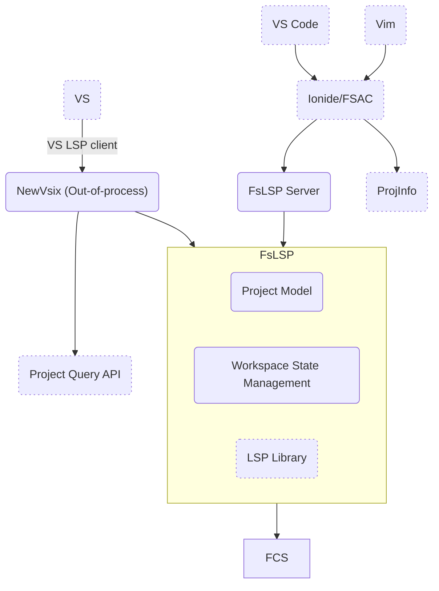
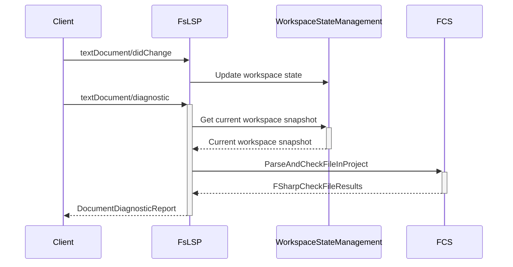
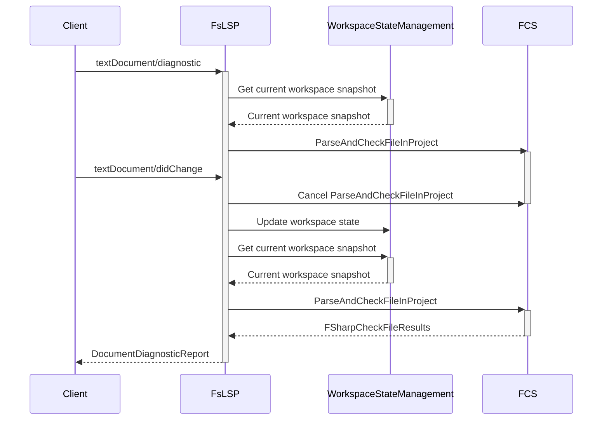
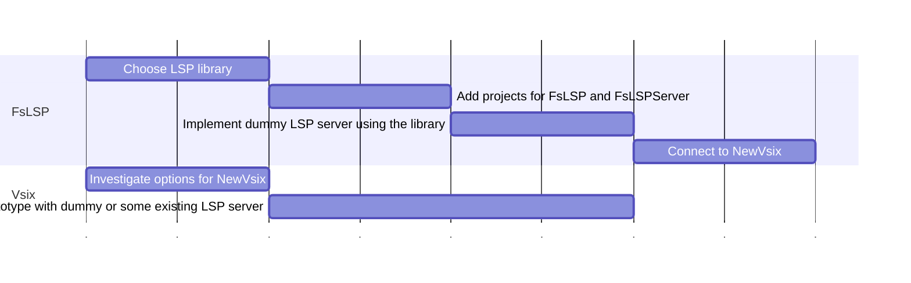
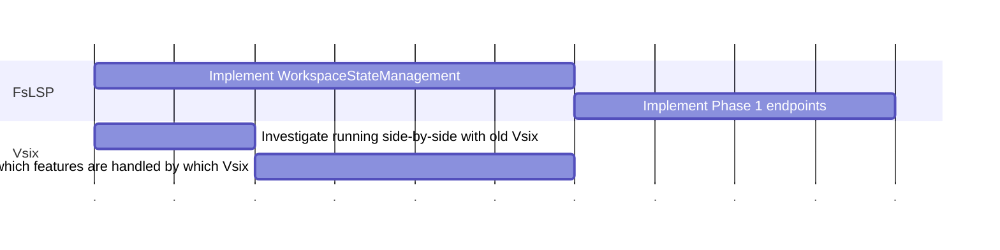
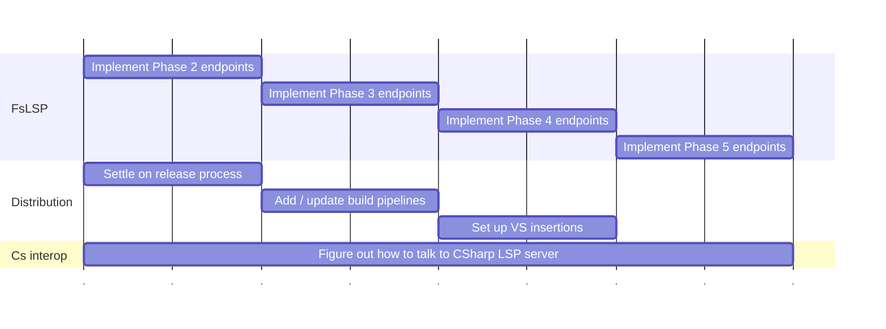

# F# LSP

F# LSP support design proposal. To be expanded as we learn more / settle on things.

## Table of contents

- [F# LSP](#f-lsp)
  - [Table of contents](#table-of-contents)
  - [Goals / Requirements](#goals--requirements)
  - [Overview](#overview)
  - [Components](#components)
    - [FsLSP](#fslsp)
      - [FsLSPServer](#fslspserver)
      - [Workspace State Management](#workspace-state-management)
        - [Things to keep track of:](#things-to-keep-track-of)
      - [Project model](#project-model)
      - [Example sequence diagram](#example-sequence-diagram)
      - [Concurrency and cancellation](#concurrency-and-cancellation)
      - [Request tracking](#request-tracking)
      - [Configuration updates](#configuration-updates)
      - [Extensibility](#extensibility)
      - [Release process](#release-process)
    - [NewVsix](#newvsix)
    - [FCS](#fcs)
  - [LSP library](#lsp-library)
    - [Candidates](#candidates)
  - [LSP client (?)](#lsp-client-)
  - [Diagnostic mode](#diagnostic-mode)
  - [LSIF](#lsif)
  - [Performance](#performance)
  - [Analyzers \& Refactoring support](#analyzers--refactoring-support)
  - [Mixed F# / C# solutions](#mixed-f--c-solutions)
  - [Multiple workspace support](#multiple-workspace-support)
  - [Action plan](#action-plan)
    - [Phase 0](#phase-0)
    - [Phase 1](#phase-1)
    - [Phase 2 - 5](#phase-2---5)
  - [LSP Endpoints](#lsp-endpoints)

## Goals / Requirements

- Fully featured F# LSP server implementation that can be used by any editor
  - Can be used as a library (with optional customization) or executable
  - Independent of any particular project system - this needs to be handled by the client
  - Target LSP protocol version 3.17 (at least initially, we can upgrade as we go)
  - Support all useful LSP APIs
  - Support for analyzers
  - Support for code fixes and refactoring
  - Support for mixed F# / C# solutions (being able to delegate to C# LSP server)
  - Good performance
  - Support for multiple workspaces
  - Support for LSIF
- Visual Studio extension that will use the LSP server

## Overview

| Component | Description | Release Process |
| --- | --- | --- |
| FCS | F# Compiler Service | Nuget |
| **FsLSP** | The F# LSP library. This can be used to create an LSP server.  | Nuget |
| - **FsLSPServer** | The F# LSP server. An executable that can be started and will process LSP calls. Thin wrapper around FsLSP. | with **FsLSP** |
|  - **Workspace State Management** | A system for keeping a "current snapshot" of projects the user is working with |  |
|  - **Project Model** | A model for a project system we will use since we can't be tied to any particular one | |
|  - LSP Library | A ready made library we will hopefully find to simplify LSP server development |  |
| **NewVsix** | The new VS Extension which will be powered by LSP | with VS |

## Components

### FsLSP

The library containing the LSP functionality. Can be used to create an LSP server by adding the transport layer.

#### FsLSPServer

The LSP server executable using STD IN/OUT for transport.

Will be packaged with FsLSP and available as a dotnet tool (?)

It should always target the latest .NET runtime.

#### Workspace State Management

This part of the library is responsible for keeping track of the current workspace state. The internal workspace model is used to create requests for FCS. It needs to make sure the internal state doesn't get out of sync with what's in the editor and on disk.

##### Things to keep track of:
- Incoming document changes
- Documents' open/closed status
- Source files on-disk changes for documents that aren't open
- Any on-disk references that could have been rebuilt/updated

#### Project model

We need some internal model for a workspace/solution with projects. We don't want to use any project system library because we don't need most of the functionality which will be instead handled by the client.

The model needs to be able to quickly absorb incoming changes and easily convert to (or already contain) inputs for FCS. We could consider a reactive/adaptive approach for this.

We should keep track of versions of each project and source file including all dependencies with regards to parsing and type checking.

#### Example sequence diagram

#### Concurrency and cancellation

We need to make sure when a project snapshot is needed to process a request, it will always contain all change notifications that were received before. There shouldn't be need for a global request queue, possibly only for change notifications inside WorkspaceStateManagement. And any language requests will wait until WorkspaceStateManagement has absorbed all previous changes.

For cancellation we should decide, potentially on a case-by-case basis what to do when an incoming change notification invalidates an ongoing request.

1. Do nothing and let the request run either until it completes or is cancelled by the client. This is the easiest so we will probably start with this.
2. Cancel the request and return "cancelled" result to the client. The client then needs to deal with it.
3. Internally restart the work updated inputs and complete the original request until cancelled. This mode might save a bunch of back-and-forth with the client when user is typing. But it requires the client to expect it and not send cancellations a re-requests for the same thing.

Request update example

#### Request tracking

This will hopefully be handled by the LSP library. Although we might need to be able to keep track of requests in progress for the purpose of cancellation.

#### Configuration updates

We should be able to apply configuration changes that require re-creating the FCS checker. We should be able to keep the caches since the results shouldn't depend on checker settings (rather only the input Project Snapshots).

#### Extensibility

The FsLSP library should be extensible by adding custom endpoints or overriding existing ones.

It should also allow to hook into background processes or events to customize behavior.

The code for extending the behavior should look the same as the code for implementing the core functionality. That way it's easy to test out and then potentially contribute it directly to the library.

#### Release process

We should use a similar release process as we have now for FCS. Potentially also provide a pre-release package with the latest version from `main`.

### NewVsix

New VS extension that will be backed by the LSP server. It should mostly contain plumbing to connect LSP to the editor and CPS.

We should build on new [VisualStudio.Extensibility](https://github.com/microsoft/VSExtensibility/) model to run the extension out-of-process. It can also directly connect native VS LSP directly to our server which we can host directly in the extension.

We might need a wrapper C# project because the new extensibility model relies on source generation.

We should be able to load project information via [ProjectQuery API](https://github.com/microsoft/VSExtensibility/tree/main/New_Extensibility_Model/Samples/VSProjectQueryAPISample) to which we can also subscribe for changes.

The new extension should be able to run side by side with the current and extension gradually take over the functionality we will add to LSP.

If there is any missing functionality in any of these, we might need to supplement it from our current MEF extension and connect from it to the new one.

### FCS

The only strict requirement on FCS is to be able to process open files from memory and non-open files from filesystem. But probably best to abstract that within FsLSP and just provide `ISourceText` objects for both cases.

At the moment this is possible via the experimental `DocumentSource.Custom` parameter. But hopefully we will be able to use a new `FSharpProjectSnapshot` model (from [#15179](https://github.com/dotnet/fsharp/pull/15179)) which combines all the necessary inputs into a single object.

## LSP library

The library needs to support all the features we want to implement including the ability to add custom F# ones. It also shouldn't incur an unnecessary performance overhead.

### Candidates

| Library  | Pros | Cons |
| ---  | --- | --- |
| We write our own | + Complete control over everything | - A lot of extra work |
| [Ionide LanguageServerProtocol](https://github.com/ionide/LanguageServerProtocol) | + Battle tested with Ionide and FSAC + Natural F# API | - Might not be able to fully customize it to our need |
| [Roslyn CLaSP](https://github.com/dotnet/roslyn/blob/main/src/Features/LanguageServer/Microsoft.CommonLanguageServerProtocol.Framework/README.md) | + Should be performant + Future support | - Not stable API - Unnatural C# API |
| [OmniSharp C# LSP](https://github.com/OmniSharp/csharp-language-server-protocol)  |  | - Unnatural C# API |

It probably makes sense to start with an existing library which should be able to get us to a working product and only then consider writing our own in case it's the only way to enable more functionality or performance.

## LSP client (?)

- Is there any code that can be shared by various clients?
- Most likely not, since each client will be specific to its platform and project system

## Diagnostic mode

Initially we will be offering the **Pull Diagnostics** mode where the client will request diagnostics for a particular document. It will be up to the client to ask for diagnostics for documents at appropriate times and cancel requests that are no longer needed. The client can also use this to implement background checking of all documents in the workspace.

Later we can also add an option to have the server control diagnostics and publish them via **Publish Diagnostics**. Then it will be pushing diagnostics as they are discovered either for active document, open documents or all documents.

## LSIF

We should eventually add support for LSIF. At the moment it looks like we would have to construct it manually (as in, no helpful libraries are available).

This is probably lower priority than anything else.

It might also be a good opportunity to re-think how we store symbols for purposes of finding references, go to definition, or code search (go to symbol in workspace by name/query).

## Performance

Areas to pay attention to with regards to performance

- Serialization. Hopefully this will be handled reasonably by a library.
- Spamming too many requests. Though this will be mainly up to the client, we could think about throttling or debouncing.
- Caching. This will be mostly up to FCS but we can send hints about what can be cleaned up.

## Analyzers & Refactoring support

These will hopefully not require any special treatment and can just use existing LSP APIs.

## Mixed F# / C# solutions

We need to figure out how to talk to C# LSP server for:

- Go to definition
- Find references / rename
- (Make sure these work both ways)

## Multiple workspace support

We should be able to use a single instance of LSP server even for multiple workspaces. We can keep a separate instance of `WorkspaceStateManagement` for each workspace but send language requests to a single instance of FCS checker. This way it's possible to reuse some results if the workspaces share the same projects (with the same options).

## Action plan

A rough draft of how to plan the work and which items can be done in parallel.

### Phase 0

We need to investigate which system we'll use for the New Vsix. Ideally we're able to go with new VisualStudio.Extensibility but if that has any blockers we might need to stick to in-process MEF.

We can prototype the New Vsix with some sample LSP server or maybe with an existing one like FSAC. Just to figure out how to connect it to F# projects in VS.

For FsLSP we need to choose a library and implement a dummy LSP server with it that we can connect to the New Vsix and get some sort of basic setup that can then be improved upon.

<!-- Note: these charts don't contain actual time estimates -->

### Phase 1

Get some sort of working prototype that can do semantic highlighting and show diagnostics.

Figure out how to run side-by-side and gradually take over functionality from the current Vsix, if possible.

### Phase 2 - 5

Implement endpoints based on their assigned priority. See next section.

Independently we can start on setting up the build & release process for FsLSP and insertions of NewVsix into VS.

Another potentially parallel track can be figuring out interop with C# LSP server for mixed solutions.

## LSP Endpoints

This is a preliminary list of LSP APIs we want (or don't want) to implement, roughly ordered by priority. We will probably re-classify some of them as we go.

| Name                                     | Type         | Direction | Category                          | Priority / Dev phase | Supported by FSAC | Note                                              |
| ---------------------------------------- | ------------ | --------- | --------------------------------- | -------------------- | ----------------- | ------------------------------------------------- |
| `initialize`                             | Request      | ↩️         | Lifecycle                         | 0                    | ✅                 |                                                   |
| `initialized`                            | Notification | ➡️         | Lifecycle                         | 0                    |                   |                                                   |
| `textDocument/didChange`                 | Notification | ➡️         | Document synchronization          | 1                    | ✅                 |                                                   |
| `textDocument/didClose`                  | Notification | ➡️         | Document synchronization          | 1                    |                   |                                                   |
| `textDocument/didOpen`                   | Notification | ➡️         | Document synchronization          | 1                    | ✅                 |                                                   |
| `textDocument/diagnostic`                | Request      | ↩️         | Language features                 | 1                    |                   |                                                   |
| `textDocument/semanticTokens/full`       | Request      | ↩️         | Language features                 | 1                    |                   |                                                   |
| `$/logTrace`                             | Notification | ⬅️         | Lifecycle                         | 1                    |                   |                                                   |
| `$/setTrace`                             | Notification | ➡️         | Lifecycle                         | 1                    |                   |                                                   |
| `exit`                                   | Notification | ➡️         | Lifecycle                         | 1                    |                   |                                                   |
| `shutdown`                               | Request      | ↩️         | Lifecycle                         | 1                    |                   |                                                   |
| `completionItem/resolve`                 | Request      | ↩️         | Language features                 | 2                    | ✅                 |                                                   |
| `textDocument/completion`                | Request      | ↩️         | Language features                 | 2                    | ✅                 |                                                   |
| `textDocument/declaration`               | Request      | ↩️         | Language features                 | 2                    |                   |                                                   |
| `textDocument/definition`                | Request      | ↩️         | Language features                 | 2                    | ✅                 |                                                   |
| `textDocument/hover`                     | Request      | ↩️         | Language features                 | 2                    | ✅                 |                                                   |
| `textDocument/implementation`            | Request      | ↩️         | Language features                 | 2                    | ✅                 |                                                   |
| `textDocument/references`                | Request      | ↩️         | Language features                 | 2                    | ✅                 |                                                   |
| `textDocument/semanticTokens/full/delta` | Request      | ↩️         | Language features                 | 2                    |                   |                                                   |
| `textDocument/semanticTokens/range`      | Request      | ↩️         | Language features                 | 2                    |                   |                                                   |
| `textDocument/typeDefinition`            | Request      | ↩️         | Language features                 | 2                    | ✅                 |                                                   |
| `workspace/semanticTokens/refresh`       | Request      | ↩️         | Language features                 | 2                    | ✅                 |                                                   |
| `fsharp/compilerLocation`                | Request      | ↩️         | F# Custom                         | 3                    | ✅                 |                                                   |
| `fsharp/documentAnalyzed`                | Notification | ⬅️         | F# Custom                         | 3                    | ✅                 |                                                   |
| `fsharp/documentation`                   | Request      | ↩️         | F# Custom                         | 3                    | ✅                 |                                                   |
| `fsharp/documentationGenerator`          | Request      | ↩️         | F# Custom                         | 3                    | ✅                 |                                                   |
| `fsharp/documentationSymbol`             | Request      | ↩️         | F# Custom                         | 3                    | ✅                 |                                                   |
| `fsharp/dotnetaddproject`                | Request      | ↩️         | F# Custom                         | 3                    | ✅                 |                                                   |
| `fsharp/dotnetaddsln`                    | Request      | ↩️         | F# Custom                         | 3                    | ✅                 |                                                   |
| `fsharp/dotnetnewlist`                   | Request      | ↩️         | F# Custom                         | 3                    | ✅                 |                                                   |
| `fsharp/dotnetnewrun`                    | Request      | ↩️         | F# Custom                         | 3                    | ✅                 |                                                   |
| `fsharp/dotnetremoveproject`             | Request      | ↩️         | F# Custom                         | 3                    | ✅                 |                                                   |
| `fsharp/fileParsed`                      | Notification | ⬅️         | F# Custom                         | 3                    | ✅                 |                                                   |
| `fsharp/lineLens`                        | Request      | ↩️         | F# Custom                         | 3                    | ✅                 |                                                   |
| `fsharp/notifyCancel`                    | Notification | ⬅️         | F# Custom                         | 3                    | ✅                 |                                                   |
| `fsharp/notifyWorkspace`                 | Notification | ⬅️         | F# Custom                         | 3                    | ✅                 |                                                   |
| `fsharp/notifyWorkspacePeek`             | Notification | ⬅️         | F# Custom                         | 3                    | ✅                 |                                                   |
| `fsharp/pipelineHint`                    | Request      | ↩️         | F# Custom                         | 3                    | ✅                 |                                                   |
| `fsharp/project`                         | Request      | ↩️         | F# Custom                         | 3                    | ✅                 |                                                   |
| `fsharp/signature`                       | Request      | ↩️         | F# Custom                         | 3                    | ✅                 |                                                   |
| `fsharp/signatureData`                   | Request      | ↩️         | F# Custom                         | 3                    | ✅                 |                                                   |
| `fsharp/testDetected`                    | Notification | ⬅️         | F# Custom                         | 3                    | ✅                 |                                                   |
| `fsharp/workspaceLoad`                   | Request      | ↩️         | F# Custom                         | 3                    | ✅                 |                                                   |
| `fsharp/workspacePeek`                   | Request      | ↩️         | F# Custom                         | 3                    | ✅                 |                                                   |
| `fsproj/addExistingFile`                 | Request      | ↩️         | F# Custom                         | 3                    | ✅                 |                                                   |
| `fsproj/addFile`                         | Request      | ↩️         | F# Custom                         | 3                    | ✅                 |                                                   |
| `fsproj/addFileAbove`                    | Request      | ↩️         | F# Custom                         | 3                    | ✅                 |                                                   |
| `fsproj/addFileBelow`                    | Request      | ↩️         | F# Custom                         | 3                    | ✅                 |                                                   |
| `fsproj/moveFileDown`                    | Request      | ↩️         | F# Custom                         | 3                    | ✅                 |                                                   |
| `fsproj/moveFileUp`                      | Request      | ↩️         | F# Custom                         | 3                    | ✅                 |                                                   |
| `fsproj/removeFile`                      | Request      | ↩️         | F# Custom                         | 3                    | ✅                 |                                                   |
| `textDocument/documentHighlight`         | Request      | ↩️         | Language features                 | 3                    | ✅                 |                                                   |
| `textDocument/documentSymbol`            | Request      | ↩️         | Language features                 | 3                    | ✅                 |                                                   |
| `textDocument/formatting`                | Request      | ↩️         | Language features                 | 3                    | ✅                 |                                                   |
| `textDocument/rename`                    | Request      | ↩️         | Language features                 | 3                    | ✅                 |                                                   |
| `textDocument/signatureHelp`             | Request      | ↩️         | Language features                 | 3                    | ✅                 |                                                   |
| `$/progress`                             | Notification | ⬅️         | Window Features                   | 3                    | ✅                | Would be nice to have for long running operations |
| `workspace/didChangeWatchedFiles`        | Notification | ➡️         | Workspace Features                | 3                    | ✅                 |                                                   |
| `textDocument/willSave`                  | Notification | ➡️         | Document synchronization          | 4                    |                   |                                                   |
| `textDocument/willSaveWaitUntil`         | Request      | ↩️         | Document synchronization          | 4                    |                   |                                                   |
| `codeAction/resolve`                     | Request      | ↩️         | Language features                 | 4                    |                   |                                                   |
| `codeLens/resolve`                       | Request      | ↩️         | Language features                 | 4                    | ✅                 |                                                   |
| `inlayHint/resolve`                      | Request      | ↩️         | Language features                 | 4                    |                   |                                                   |
| `textDocument/codeAction`                | Request      | ↩️         | Language features                 | 4                    | ✅                 |                                                   |
| `textDocument/codeLens`                  | Request      | ↩️         | Language features                 | 4                    | ✅                 |                                                   |
| `textDocument/prepareRename`             | Request      | ↩️         | Language features                 | 4                    |                   |                                                   |
| `textDocument/publishDiagnostics`        | Notification | ⬅️         | Language features                 | 4                    | ✅                 |                                                   |
| `workspace/codeLens/refresh`             | Request      | ↪️         | Language Features                 | 4                    | ✅                 |                                                   |
| `window/showMessage`                     | Notification | ⬅️         | Window Features                   | 4                    | ✅                 |                                                   |
| `workspace/configuration`                | Request      | ↪️         | Workspace Features                | 4                    |                   |                                                   |
| `workspace/diagnostic`                   | Request      | ↩️         | Workspace Features                | 4                    |                   |                                                   |
| `workspace/didChangeConfiguration`       | Notification | ➡️         | Workspace Features                | 4                    | ✅                 |                                                   |
| `workspace/symbol`                       | Request      | ↩️         | Workspace Features                | 4                    | ✅                 |                                                   |
| `workspaceSymbol/resolve`                | Request      | ↩️         | Workspace Features                | 4                    |                   |                                                   |
| `notebookDocument/didChange`             | Notification | ➡️         | Notebook Document synchronization | 5                    |                   |                                                   |
| `notebookDocument/didClose`              | Notification | ➡️         | Notebook Document synchronization | 5                    |                   |                                                   |
| `notebookDocument/didOpen`               | Notification | ➡️         | Notebook Document synchronization | 5                    |                   |                                                   |
| `notebookDocument/didSave`               | Notification | ➡️         | Notebook Document synchronization | 5                    |                   |                                                   |
| `fsharp/f1Help`                          | Request      | ↩️         | F# Custom                         | ❔                    | ✅                 |                                                   |
| `fsharp/fsdn`                            | Request      | ↩️         | F# Custom                         | ❔                    | ✅                 |                                                   |
| `fsharp/loadAnalyzers`                   | Request      | ↩️         | F# Custom                         | ❔                    | ✅                 |                                                   |
| `callHierarchy/incomingCalls`            | Request      | ↩️         | Language features                 | ❔                    |                   |                                                   |
| `callHierarchy/outgoingCalls`            | Request      | ↩️         | Language features                 | ❔                    |                   |                                                   |
| `documentLink/resolve`                   | Request      | ↩️         | Language features                 | ❔                    |                   |                                                   |
| `textDocument/documentLink`              | Request      | ↩️         | Language features                 | ❔                    |                   | Is this useful for us?                            |
| `textDocument/inlayHint`                 | Request      | ↩️         | Language features                 | ❔                    |                   |                                                   |
| `textDocument/inlineValue`               | Request      | ↩️         | Language features                 | ❔                    |                   |                                                   |
| `textDocument/moniker`                   | Request      | ↩️         | Language features                 | ❔                    |                   |                                                   |
| `textDocument/prepareCallHierarchy`      | Request      | ↩️         | Language features                 | ❔                    |                   |                                                   |
| `textDocument/prepareTypeHierarchy`      | Request      | ↩️         | Language features                 | ❔                    |                   |                                                   |
| `textDocument/rangeFormatting`           | Request      | ↩️         | Language features                 | ❔                    |                   |                                                   |
| `textDocument/selectionRange`            | Request      | ↩️         | Language features                 | ❔                    |                   |                                                   |
| `typeHierarchy/subtypes`                 | Request      | ↩️         | Language features                 | ❔                    |                   |                                                   |
| `typeHierarchy/supertypes`               | Request      | ↩️         | Language features                 | ❔                    |                   |                                                   |
| `client/registerCapability`              | Request      | ↩️         | Lifecycle                         | ❔                    |                   |                                                   |
| `client/unregisterCapability`            | Request      | ↩️         | Lifecycle                         | ❔                    |                   |                                                   |
| `telemetry/event`                        | Notification | ⬅️         | Window Features                   | ❔                    | ✅                 |                                                   |
| `window/logMessage`                      | Notification | ⬅️         | Window Features                   | ❔                    | ✅                 |                                                   |
| `window/workDoneProgress/cancel`         | Notification | ⬅️         | Window Features                   | ❔                    |                   |                                                   |
| `window/workDoneProgress/create`         | Request      | ↩️         | Window Features                   | ❔                    |                   |                                                   |
| `workDoneProgress/cancel`                | Notification | ➡️         | Window Features                   | ❔                    |                   |                                                   |
| `workDoneProgress/create`                | Request      | ⬅️         | Window Features                   | ❔                    |                   |                                                   |
| `workspace/applyEdit`                    | Request      | ↪️         | Workspace Features                | ❔                    | ✅               | Could be used for refactoring?                   |
| `workspace/diagnostic/refresh`           | Request      | ↪️         | Workspace Features                | ❔                    |                   |                                                   |
| `workspace/executeCommand`               | Request      | ↩️         | Workspace Features                | ❔                    |                   | Could be used for refactoring?                   |
| `textDocument/didSave`                   | Notification | ➡️         | Document synchronization          | ❌                    | ✅                 | Probably don't need this?                         |
| `textDocument/colorPresentation`         | Request      | ↩️         | Language features                 | ❌                    |                   |                                                   |
| `textDocument/documentColor`             | Request      | ↩️         | Language features                 | ❌                    |                   |                                                   |
| `textDocument/linkedEditingRange`        | Request      | ↩️         | Language features                 | ❌                    |                   |                                                   |
| `textDocument/onTypeFormatting`          | Request      | ↩️         | Language features                 | ❌                    |                   |                                                   |
| `window/showDocument`                    | Request      | ↪️         | Window Features                   | ❌                    |                   |                                                   |
| `window/showMessageRequest`              | Request      | ↪️         | Window Features                   | ❌                    |                   |                                                   |
| `workspace/didChangeWorkspaceFolders`    | Notification | ➡️         | Workspace Features                | ❌                    |                   |                                                   |
| `workspace/didCreateFiles`               | Notification | ➡️         | Workspace Features                | ❌                    |                   |                                                   |
| `workspace/didDeleteFiles`               | Notification | ➡️         | Workspace Features                | ❌                    |                   |                                                   |
| `workspace/didRenameFiles`               | Notification | ➡️         | Workspace Features                | ❌                    |                   |                                                   |
| `workspace/willCreateFiles`              | Notification | ➡️         | Workspace Features                | ❌                    |                   |                                                   |
| `workspace/willDeleteFiles`              | Notification | ➡️         | Workspace Features                | ❌                    |                   |                                                   |
| `workspace/willRenameFiles`              | Notification | ➡️         | Workspace Features                | ❌                    |                   |                                                   |
| `workspace/workspaceFolders`             | Request      | ⬅️         | Workspace Features                | ❌                    |                   |                                                   |
|                                          |              |           |                                   |                      |                   |                                                   |
