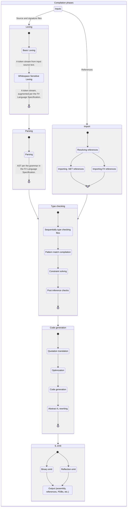

# Overview

There are several artifacts involved in the development of F#:

* FSharp.Compiler.Service ([docs](fcs/), [source](https://github.com/dotnet/fsharp/tree/main/src/Compiler)). Contains all logic for F# compilation - including parsing, syntax tree processing, typechecking, constraint solving, optimizations, IL importing, IL writing, pretty printing of F# constructs, and F# metadata format processing - and the F# compiler APIs for tooling.

* The [F# compiler executable](https://github.com/dotnet/fsharp/tree/main/src/fsc), called `fsc`, which is called as a console app. It sets the .NET GC into batch mode and then invokes `FSharp.Compiler.Service` with command-line arguments.

* The [FSharp.Core Library](https://github.com/dotnet/fsharp/tree/main/src/FSharp.Core), called `FSharp.Core`. Contains all primitive F# types and logic for how they interact, core data structures and library functions for operating on them, structured printing logic, units of measure for scientific programming, core numeric functionality, F# quotations, F# type reflection logic, and asynchronous programming types and logic.

* The [F# Interactive tool](https://github.com/dotnet/fsharp/tree/main/src/fsi), called `fsi`. A REPL for F# that supports execution and pretty-printing of F# code and results, loading F# script files, referencing assemblies, and referencing packages from NuGet.

The `FSharp.Compiler.Service` is by far the largest of these components and contains nearly all logic that `fsc` and `fsi` use. It is the primary subject of this guide.

## Key compiler data formats and representations

The following are the key data formats and internal data representations of the F# compiler code in its various configurations:

* _Input source files_  Read as Unicode text, or binary for referenced assemblies.

* _Input command-line arguments_  See [CompilerOptions.fs](https://github.com/dotnet/fsharp/blob/main/src/Compiler/Driver/CompilerOptions.fs) for the full code implementing the arguments table. Command-line arguments are also accepted by the F# Compiler Service API in project specifications, and as optional input to F# Interactive.

* _Tokens_, see [pars.fsy](https://github.com/dotnet/fsharp/blob/main/src/Compiler/pars.fsy), [lex.fsl](https://github.com/dotnet/fsharp/blob/main/src/Compiler/lex.fsl), [LexHelpers.fs](https://github.com/dotnet/fsharp/blob/main/src/Compiler/SyntaxTree/LexHelpers.fs) and related files.

* _Abstract Syntax Tree (AST)_, see [SyntaxTree.fs](https://github.com/dotnet/fsharp/blob/main/src/Compiler/SyntaxTree/SyntaxTree.fs), the untyped syntax tree resulting from parsing.

* _Typed Abstract Syntax Tree (Typed Tree)_, see [TypedTree.fs](https://github.com/dotnet/fsharp/blob/main/src/Compiler/TypedTree/TypedTree.fs), [TypedTreeBasics.fs](https://github.com/dotnet/fsharp/blob/main/src/Compiler/TypedTree/TypedTreeBasics.fs), [TypedTreeOps.fs](https://github.com/dotnet/fsharp/blob/main/src/Compiler/TypedTree/TypedTreeOps.fs), and related files. The typed, bound syntax tree including both type/module definitions and their backing expressions, resulting from type checking and the subject of successive phases of optimization and representation change.

* _Type checking context/state_, see for example [`TcState` in ParseAndCheckInputs.fsi](https://github.com/dotnet/fsharp/blob/main/src/Compiler/Driver/ParseAndCheckInputs.fsi) and its constituent parts, particularly `TcEnv` in [CheckExpressions.fsi](https://github.com/dotnet/fsharp/blob/main/src/Compiler/Checking/CheckExpressions.fsi) and `NameResolutionEnv` in [NameResolution.fsi](https://github.com/dotnet/fsharp/blob/main/src/Compiler/Checking/NameResolution.fsi). A set of tables representing the available names, assemblies etc. in scope during type checking, plus associated information.

* _Abstract IL_, the output of code generation, then used for binary generation, and the input format when reading .NET assemblies, see [`ILModuleDef` in il.fsi](https://github.com/dotnet/fsharp/blob/main/src/Compiler/AbstractIL/il.fsi).

* _The .NET Binary format_ (with added "pickled" F# Metadata resource), the final output of fsc.exe, see the ECMA 335 specification and the [ilread.fs](https://github.com/dotnet/fsharp/blob/main/src/Compiler/AbstractIL/ilread.fs) and [ilwrite.fs](https://github.com/dotnet/fsharp/blob/main/src/Compiler/AbstractIL/ilwrite.fs) binary reader/generator implementations. The added F# metadata is stored in a binary resource, see [TypedTreePickle.fs](https://github.com/dotnet/fsharp/blob/main/src/Compiler/TypedTree/TypedTreePickle.fs).

* _The incrementally emitted .NET reflection assembly,_ the incremental output of fsi.exe. See [ilreflect.fs](https://github.com/dotnet/fsharp/blob/main/src/Compiler/AbstractIL/ilreflect.fs).

## Key constructs and APIs for F# tooling

The following are the most relevant parts of the F# compiler tooling, making up the "engine" and API surface area of `FSharp.Compiler.Service`.

* The incremental project build engine state in [IncrementalBuild.fsi](https://github.com/dotnet/fsharp/tree/main/src/Compiler/Service/IncrementalBuild.fsi)/[IncrementalBuild.fs](https://github.com/dotnet/fsharp/tree/main/src/Compiler/Service/IncrementalBuild.fs), a part of the F# Compiler Service API.

* The corresponding APIs wrapping and accessing these structures in the public-facing [`FSharp.Compiler.Service` API](https://github.com/dotnet/fsharp/tree/main/src/Compiler/Service) and [Symbol API](https://github.com/dotnet/fsharp/tree/main/src/Compiler/Symbols).

* The [F# Compiler Service Caches](https://fsharp.github.io/FSharp.Compiler.Service/caches.html), the various caches maintained by an instance of an `FSharpChecker`.

## Key compiler phases

The following is a diagram of how the different phases of the F# compiler work:

The following are the key phases and high-level logical operations of the F# compiler code in its various configurations:

* _Basic lexing_. Produces a token stream from input source file text.

* _White-space sensitive lexing_. Accepts and produces a token stream, augmenting per the [F# Language Specification](https://fsharp.org/specs/language-spec/).

* _Parsing_. Accepts a token stream and produces an AST per the grammar in the [F# Language Specification](https://fsharp.org/specs/language-spec/).

* _Resolving references_. For .NET SDK generally references are resolved explicitly by external tooling.
   There is a legacy aspect to this if references use old .NET Framework references including for
   scripting.  See [ReferenceResolver.fs](https://github.com/dotnet/fsharp/blob/main/src/Compiler/Facilities/ReferenceResolver.fs) for the abstract definition of compiler reference resolution. See [LegacyMSBuildReferenceResolver.fs](https://github.com/dotnet/fsharp/blob/main/src/Compiler/Legacy/LegacyMSBuildReferenceResolver.fs) for reference resolution used by the .NET Framework F# compiler when running on .NET Framework. See [SimulatedMSBuildReferenceResolver.fs](https://github.com/dotnet/fsharp/blob/main/src/Compiler/Facilities/SimulatedMSBuildReferenceResolver.fs) when not using the .NET Framework F# compiler.
   See [DependencyManager](https://github.com/dotnet/fsharp/tree/main/src/Compiler/DependencyManager) for reference resolution and package management used in `fsi`.

* _Importing referenced .NET binaries_, see [import.fsi](https://github.com/dotnet/fsharp/blob/main/src/Compiler/Checking/import.fsi)/[import.fs](https://github.com/dotnet/fsharp/blob/main/src/Compiler/Checking/import.fs). Accepts file references and produces a Typed Tree node for each referenced assembly, including information about its type definitions (and type forwarders if any).

* _Importing referenced F# binaries and optimization information as Typed Tree data structures_, see [TypedTreePickle.fs](https://github.com/dotnet/fsharp/blob/main/src/Compiler/TypedTree/TypedTreePickle.fs). Accepts binary data and produces  Typed Tree nodes for each referenced assembly, including information about its type/module/function/member definitions.

* _Sequentially type checking files_, see [CheckDeclarations.fsi](https://github.com/dotnet/fsharp/blob/main/src/Compiler/Checking/CheckDeclarations.fsi)/[CheckDeclarations.fs](https://github.com/dotnet/fsharp/blob/main/src/Compiler/Checking/CheckDeclarations.fs). Accepts an AST plus a type checking context/state and produces new Typed Tree nodes
  incorporated into an updated type checking state, plus additional Typed Tree Expression nodes used during code generation.  A key part of this is
  checking syntactic types and expressions, see [CheckExpressions.fsi](https://github.com/dotnet/fsharp/blob/main/src/Compiler/Checking/CheckDeclarations.fsi)/[CheckExpressions.fs](https://github.com/dotnet/fsharp/blob/main/src/Compiler/Checking/CheckDeclarations.fs) including the state held across the checking of a file (see `TcFileState`) and the
  environment active as we traverse declarations and expressions (see `TcEnv`).

* _Pattern match compilation_, see [PatternMatchCompilation.fsi](https://github.com/dotnet/fsharp/blob/main/src/Compiler/Checking/PatternMatchCompilation.fsi)/[PatternMatchCompilation.fs](https://github.com/dotnet/fsharp/blob/main/src/Compiler/Checking/PatternMatchCompilation.fs). Accepts a subset of checked Typed Tree nodes representing F# pattern matching and produces Typed Tree expressions implementing the pattern matching. Called during type checking as each construct involving pattern matching is processed.

* _Constraint solving_, see [ConstraintSolver.fsi](https://github.com/dotnet/fsharp/blob/main/src/Compiler/Checking/ConstraintSolver.fsi)/[ConstraintSolver.fs](https://github.com/dotnet/fsharp/blob/main/src/Compiler/Checking/ConstraintSolver.fs). A constraint solver state is maintained during type checking of a single file, and constraints are progressively asserted (i.e. added to this state). Fresh inference variables are generated and variables are eliminated (solved). Variables are also generalized at various language constructs, or explicitly declared, making them "rigid". Called during type checking as each construct is processed.

* _Post-inference type checks_, see [PostInferenceChecks.fsi](https://github.com/dotnet/fsharp/blob/main/src/Compiler/Checking/PostInferenceChecks.fsi)/[PostInferenceChecks.fs](https://github.com/dotnet/fsharp/blob/main/src/Compiler/Checking/PostInferenceChecks.fs). Called at the end of type checking/inference for each file. A range of checks that can only be enforced after type checking on a file is complete, such as analysis when using `byref<'T>` or other `IsByRefLike` structs.

* _Quotation translation_, see [QuotationTranslator.fsi](https://github.com/dotnet/fsharp/blob/main/src/Compiler/Checking/QuotationTranslator.fsi)/[QuotationTranslator.fs](https://github.com/dotnet/fsharp/blob/main/src/Compiler/Checking/QuotationTranslator.fs)/[QuotationPickler.fsi](https://github.com/dotnet/fsharp/blob/main/src/Compiler/Checking/QuotationPickler.fsi)/[QuotationPickler.fs](https://github.com/dotnet/fsharp/blob/main/src/Compiler/Checking/QuotationPickler.fs). Generates the stored information for F# quotation nodes, generated from the Typed Tree expression structures of the F# compiler. Quotations are ultimately stored as binary data plus some added type references. "ReflectedDefinition" quotations are collected and stored in a single blob.

* _Optimization phases_, primarily the "Optimize" (peephole/inlining) and "Top Level Representation" (lambda lifting) phases, see [Optimizer.fsi](https://github.com/dotnet/fsharp/blob/main/src/Compiler/Optimize/Optimizer.fsi)/[Optimizer.fs](https://github.com/dotnet/fsharp/blob/main/src/Compiler/Optimize/Optimizer.fs) and [InnerLambdasToTopLevelFuncs.fsi](https://github.com/dotnet/fsharp/blob/main/src/Compiler/Optimize/InnerLambdasToTopLevelFuncs.fsi)/[InnerLambdasToTopLevelFuncs.fs](https://github.com/dotnet/fsharp/blob/main/src/Compiler/Optimize/InnerLambdasToTopLevelFuncs.fs) and [LowerCalls.fs](https://github.com/dotnet/fsharp/blob/main/src/Compiler/Optimize/LowerCalls.fs). Each of these takes Typed Tree nodes for types and expressions and either modifies the nodes in place or produces new Typed Tree nodes. These phases are orchestrated in [CompilerOptions.fs](https://github.com/dotnet/fsharp/blob/main/src/Compiler/Driver/CompilerOptions.fs)

* _Code generation_, see [IlxGen.fsi](https://github.com/dotnet/fsharp/blob/main/src/Compiler/CodeGen/IlxGen.fsi)/[IlxGen.fs](https://github.com/dotnet/fsharp/blob/main/src/Compiler/CodeGen/IlxGen.fs). Accepts Typed Tree nodes and produces Abstract IL nodes, sometimes applying optimizations.

* _Abstract IL code rewriting_, see [EraseClosures.fs](https://github.com/dotnet/fsharp/blob/main/src/Compiler/CodeGen/EraseClosures.fs) and
  [EraseUnions.fs](https://github.com/dotnet/fsharp/blob/main/src/Compiler/CodeGen/EraseUnions.fs). Eliminates some constructs by rewriting Abstract IL nodes.

* _Binary emit_, see [ilwrite.fsi](https://github.com/dotnet/fsharp/blob/main/src/Compiler/AbstractIL/ilwrite.fsi)/[ilwrite.fs](https://github.com/dotnet/fsharp/blob/main/src/Compiler/AbstractIL/ilwrite.fs).

* _Reflection-Emit_, see [ilreflect.fs](https://github.com/dotnet/fsharp/blob/main/src/Compiler/AbstractIL/ilreflect.fs).

These and transformations used to build the following:

* _The F# Compiler Service API_, see the [Symbol API](https://github.com/dotnet/fsharp/tree/main/src/Compiler/Symbols) and [Service API](https://github.com/dotnet/fsharp/tree/main/src/Compiler/Service)

* _The F# Interactive Shell_, see [fsi.fs](https://github.com/dotnet/fsharp/blob/main/src/Compiler/Interactive/fsi.fs).

* _The F# Compiler Shell_, see [fsc.fs](https://github.com/dotnet/fsharp/blob/main/src/Compiler/Driver/fsc.fs) and [fscmain.fs](https://github.com/dotnet/fsharp/blob/main/src/Compiler/Driver/fscmain.fs).

## Bootstrapping

The F# compiler is bootstrapped. That is, an existing F# compiler is used to build a "proto" compiler from the current source code. That "proto" compiler is then used to compile itself, producing a "final" compiler. This ensures the final compiler is compiled with all relevant optimizations and fixes.

## FSharp.Build

`FSharp.Build.dll` and `Microsoft.FSharp.targets` give MSBuild support for F# projects (`.fsproj`) and contain the targets. Although not strictly part of the F# compiler, they are essential for using F# in all contexts for .NET, aside from some more targeted scripting scenarios. The targets expose things like the `CoreCompile` and `Fsc` tasks called by MSBuild.
