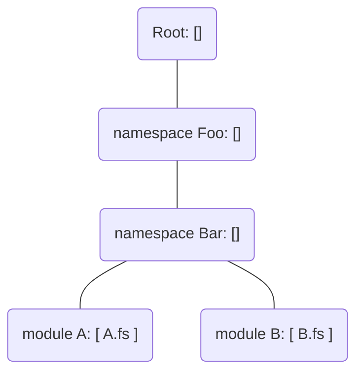
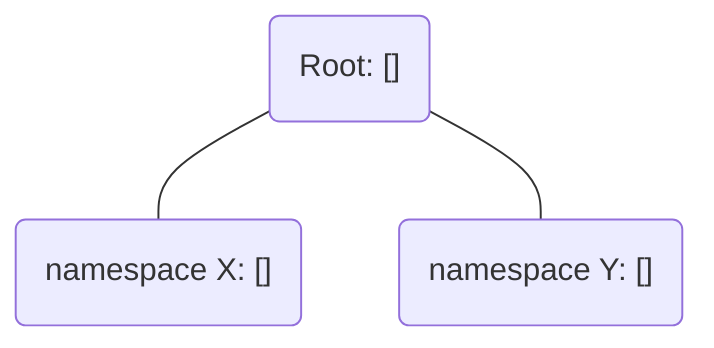

##  Parallel type-checking in FSharp
This document describes the idea and implementation details for parallel type-checking of independent files in the F# compiler.

Performance of F# compilation and code analysis is one of the concerns for big codebases.
One way to speed it up was originally described in https://github.com/dotnet/fsharp/discussions/11634 by @kerams .
That is going to be the main topic of this page.
But before we dive into the details, let's first discuss how the things work at the moment.

## Context and the current state of the compiler

### Current state of type-checking

One of the main phases of compilation is type-checking. Depending on the project in question, it can take as much as 50% of the total compilation time.
Currently, by default all files in a project are type-checked in sequence, one-by-one, leading to increased compilation wall-clock time.

The same is true about code analysis (used by the IDEs), but to an even higher degree - since code analysis skips some of the expensive compilation phases, type-checking represents a bigger fraction of the total wall-clock time, hence any improvements in this area can lead to more drastic total time reduction.

### Maintaining type-checking state

There is a lot of information associated with type-checking individual files and groups of them.

Currently, due to the (mostly) sequential nature of the processing, it is sufficient to maintain a single instance of such information for the whole project.
This instance is incrementally built on as more and more files have been processed.

### Recent addition - "Parallel type checking for impl files with backing sig files"

A recent [change](https://github.com/dotnet/fsharp/pull/13737) introduced in the compiler added a level of parallelism in type-checking (behind an experimental feature flag).
It allows for parallel type-checking of implementation files backed by signature files.
Such files by definition cannot be depended upon by any other files w.r.t. type-checking, since all the necessary information is exposed by the corresponding `.fsi` files.

The new feature, when enabled, allows partial parallelisation of type-checking as follows:
1. All `.fsi` files and `.fs` files without backing `.fsi` files are type-checked in sequence, as before.
2. Then all `.fs` files with backing `.fsi` files are type-checked in parallel.

For a project that uses `.fsi` files throughout, such as the `FSharp.Compiler.Service` project, this presents a major speedup.

Some data points:
- [Fantomas](https://github.com/fsprojects/fantomas) solution: total build time 17.49s -> 14.28s - [link](https://github.com/dotnet/fsharp/pull/13737#issuecomment-1223637818)
- F# codebase build time: 112s -> 92s - [link](https://github.com/dotnet/fsharp/pull/13737#issuecomment-1223386853)

#### Enabling the feature
The feature is opt-in and can be enabled in the compiler via a CLI arg & MSBuild property.

## The importance of using Server GC for parallel work

By default .NET processes use Workstation GC, which is single-threaded. What this means is it can become a bottleneck for highly-parallel operations, due to increased GC pressure and the cost of GC pauses being multiplied by the number of threads waiting. 
That is why when increasing parallelisation of the compiler and the compiler service it is important to note the GC mode being used and consider enabling Server GC.
This is no different for parallel type-checking - any performance tests of the feature should be done using Server GC. 

Below is an example showing the difference it can make for a parallel workflow.

### Parallel projects analysis results for a synthetic solution
| GC Mode     | Processing Mode | Time                                    |
|-------------|-----------------|-----------------------------------------|
| Workstation | Sequential      | 16005ms                                 |
| Workstation | Parallel        | 10849ms                                 |
| Server      | Sequential      | 14594ms (-9% vs Workstation Sequential) |
| Server      | Parallel        | 2659ms (-75% vs Workstation Parallel)   |

For more details see https://github.com/dotnet/fsharp/pull/13521

## Parallel type-checking of independent files

The main idea is quite simple:
- process files in a graph order instead of sequential order
- quickly reduce the dependency graph used for type-checking, increasing parallelism possible
- implement delta-based type-checking that allows building a 'fresh' TcState copy from a list of delta-based results.

Below is some quasi-theoretical background on type-checking in general.

### Background
Files in an F# project are ordered and processed from the top (first) and the bottom (last) file.
The compiler ensures that no information, including type information, flows upwards.

Consider the following list of files in a project:
```fsharp
A.fs
B.fs
C.fs
D.fs
```
By default, they are type-checked in the order of appearance: `[A.fs, B.fs, C.fs, D.fs]`

Let's define `allowed dependency` as follows:
> If the contents of 'B.fs' _can_, based on its position in the project hierarchy, influence the type-checking process of 'A.fs', then 'A.fs' -> 'B.fs' is an _allowed dependency_ 

The _allowed dependencies graph_ looks as follows:
```
A.fs -> []
B.fs -> [A.fs]
C.fs -> [B.fs; A.fs]
D.fs -> [C.fs; B.fs; A.fs]
```

Sequential type-checking of files in the appearance order guarantees that when processing a given file, any files it _might_ need w.r.t. type-checking have already been type-checked and their type information is available.

### Necessary dependencies

Let's define a `necessary dependency` too:
> File 'A.fs' _necessarily depends_ on file B for type-checking purposes, if the lack of type-checking information from 'B.fs' would influence the results of type-checking 'A.fs'

And finally a `dependency graph` as follows:
> A _dependency graph_ is any graph that is a subset of the `allowed dependencies` graph and a superset of the `necessary dependencies` graph

A few slightly imprecise/vague statements about all the graphs:
1. Any dependency graph is a directed, acycling graph (DAG).
1. The _Necessary dependencies_ graph is a subgraph of the _allowed dependencies_ graph.
2. If there is no path between 'B.fs' and 'C.fs' in the _necessary dependencies_ graph, they can be type-checked in parallel (as long as there is a way to maintain more than one instance of type-checking information).
3. Type-checking _must_ process files in an order that is compatible with the topological order in the _necessary dependencies_ graph.
4. If using a dependency graph as an ordering mechanism for (parallel) type-checking, the closer it is to the _necessary dependencies_ graph, the higher parallelism is possible.
5. Type-checking files in appearance order is equivalent to using the `allowed dependencies` graph for ordering.
6. Removing an edge from the _dependency_ graph used _can_ increase (but not decrease) the level of parallelism possible and improve wall-clock time.

Let's look at point `6.` in more detail.

### The impact of reducing the dependency graph on type-checking parallelisation and wall-clock time.

Let us make a few definitions and simplifications:
1. Time it takes to type-check file f = `T(f)`
2. Time it takes to type-check files f1...fn in parallel = `T(f1+...fn)`
3. Time it takes to type-check a file f and all its dependencies = `D(f)`
4. Time it takes to type-check the graph G = `D(G)`
5. Type-checking is performed on a machine with infinite number of parallel processors.
6. There is no slowdowns due to parallel processing, ie. T(f1+...+fn) = max(T(f1),...,T(fn))

With the above it can be observed that:
```
D(G) = max(D(f)), for any file 'f'

and

D(f) = max(D(n)) + T(f) for n = any necessary dependency of 'f'
```
In other words wall-clock time for type-checking using a given dependency graph is equal to the "longest" path in the graph.

For the _allowed dependencies graph_ the following holds:
```
D(f) = T(f) + sum(T(g)), for all files 'g' above file 'f'
```
In other words, the longest path's length = the sum of times to type-check all files.

Therefore the change that parallel type-checking brings is the replacement of the _allowed dependencies_ graph as currently used with a reduced graph that is:
- much more similar to the _necessary dependencies_ graph,
- providing a smaller value of `D(G)`.

## A way to reduce the dependency graph used

For all practical purposes the only way to calculate the _necessary dependencies_ graph fully accurately is to perform the type-checking process, which misses the point of this exercise.

However, there exist cheaper solutions that reduce the initial graph significantly with low computational cost, providing a good trade-off.

As noted in https://github.com/dotnet/fsharp/discussions/11634 , scanning the ASTs can provide a lot information that helps narrow down the set of types, modules/namespaces and files that a given file _might_ depend on.

This is the approach used in this solution.

The dependency detection algorithm can be summarised as follows:
1. Build a single [Trie](https://en.wikipedia.org/wiki/Trie) composed of all the found namespaces and (nested) modules.
   For each parsed file in parallel, create the found Trie nodes. Afterwards merge them into a single Trie.
   Note that we if a file is backed by a signature, only the signature will contribute nodes to the Trie.
   Inside each node, we keep track of what file indexes contributed to its existence. 
   Note that each `Trie` has a special `Root` node. This node can be populated by top level `AutoModule` modules or `global` namespaces.
2. For each parsed file in parallel, use its parsed AST to extract the following:
    1. Top-level modules and namespaces. Consider `AutoOpens`.
    2. Opens, partial module/namespace references. Consider module abbreviations, partial opens etc.
    3. Prefixed identifiers (for example, `System.Console` in `System.Console.Write(""")`).
    4. Nested modules.
3. For each file, in parallel:
   1. Process all file content entries found in 2. For each file content entry, we will query the Trie to see if we found a match.
      If a match is found, we assume the link between the files when the result file index is lower than the current file index.
   2. A given file will always depend on all the file indexes lower than its own index found in the `Root` node.
   3. When a file is backed by a signature, we automatically link the signature file.

### Edge-case 1. - `[<AutoOpen>]`

Modules with `[<AutoOpen>]` are in a way 'transparent', meaning that all the types/nested modules inside them are surfaced as if they were on a level above.
If a top level module contains the `[<AutoOpen>]` attribute, we assume the file to contribute to the `Root` node.

The main problem with that is that `System.AutoOpenAttribute` could be aliased and hide behind a different name.
Therefore it's not easy to see whether the attribute is being used based only on the AST.

There are ways to evaluate this, which involve scanning all module abbreviations in the project and in any referenced dlls.
However, currently the algorithm uses a shortcut: it checks whether the attribute type name is on a hardcoded list of "suspicious" names. This is not fully reliable, as an arbitrary type alias, eg. `type X = System.AutoOpenAttribute` will not be recognised correctly.

To overcome this limitation, we are raising a warning when a user is aliasing the `AutoOpenAttribute` type.

Note that we do not process nested `[<AutoOpen>]` modules indefinitely, because we establish a link when you reference any module.

```fsharp
namespace A

module B =

module C =

// The link is established as soon as module B is hit.
// Whether the content of D is pushed to C in the Trie is no longer relevant.
[<AutoOpen>]
module D =
    ()
```

### Edge-case 2. - module abbreviations

Module abbreviations do not require any special handling in the current algorithm.
Consider the following example:
```
// F1.fs
module A
module B = let x = 1

// F2.fs
module C
open A
module D = B
```
Here, the line `module D = B` generates the `F2.fs -> F1.fs` link, so no special code is needed to add it.

### Edge-case 3. - ghost namespaces

Not every node in the Trie contains file indexes.
A namespace node in the Trie, does not expose the file index when there are no types defined.  
Consider:

`A.fs`
```fsharp
module Foo.Bar.A

let a = 0
```

`B.fs`
```fsharp
module Foo.Bar.B

let b = 1
```

leads to the following Trie:



We do not want to link files `A.fs` and `B.fs` because they share a namespace.
For that reason, the namespace nodes `Foo` and `Bar` don't contain any files in the Trie.

We avoid links introducing unnecessary links by this.  
However, this can lead to following situation:

`X.fs`
```fsharp
namespace X
```

`Y.fs`
```fsharp
namespace Y

open X // This open statement is unnecessary, however it is valid F# code.
```

leads to the following Trie:



When processing `open X` in `Y.fs` a matching node will be found, however not containing any actual files.
We still need to link some file that contains `namespace X` as a dependency of `Y.fs`, this is what we consider a ghost dependency.

A link that must found to ensure type-checking succeeds. We either pick the smallest file index of the child nodes of `X` or add all files that came before it as a last resort.

### Performance
There are two main factors w.r.t. performance of the graph-based type-checking:
1. The level of parallelisation allowed by the resolved dependency graph.
2. The overhead of creating the dependency graph and graph-based processing of the graph.
At minimum, to make this feature useful, any overhead (2.) cost should in the vast majority of usecases be significantly lower than the speedup generated by 1.

Initial timings showed that the graph-based type-checking was significantly faster than sequential type-checking and faster than the two-phase type-checking feature.
Projects that were tested included:
- `FSharp.Compiler.Service`
- `Fantomas.Core`
- `FSharp.Compiler.ComponentTests`

Some initial results:

```
BenchmarkDotNet=v0.13.2, OS=Windows 11 (10.0.22621.1105)
12th Gen Intel Core i7-12700K, 1 CPU, 20 logical and 12 physical cores
.NET SDK=7.0.102
  [Host]     : .NET 7.0.2 (7.0.222.60605), X64 RyuJIT AVX2 DEBUG
  DefaultJob : .NET 7.0.2 (7.0.222.60605), X64 RyuJIT AVX2


|                Method | GraphTypeChecking |    Mean |   Error |  StdDev |        Gen0 |       Gen1 |      Gen2 | Allocated |
|---------------------- |------------------ |--------:|--------:|--------:|------------:|-----------:|----------:|----------:|
|            FSharpPlus |             False | 32.22 s | 0.615 s | 0.708 s | 202000.0000 | 10000.0000 | 4000.0000 |  51.38 GB |
| FSharpCompilerService |             False | 18.59 s | 0.192 s | 0.180 s |  10000.0000 |  4000.0000 | 2000.0000 |  21.03 GB |
|            FSharpPlus |              True | 30.86 s | 0.352 s | 0.275 s | 196000.0000 | 10000.0000 | 3000.0000 |   51.4 GB |
| FSharpCompilerService |              True | 10.88 s | 0.154 s | 0.144 s |  10000.0000 |  4000.0000 | 2000.0000 |  21.32 GB |
```

## The problem of maintaining multiple instances of type-checking information

The parallel type-checking idea generates a problem that needs to be solved.
Instead of one instance of the type-checking information, we now have to maintain multiple instances - one for each node in the graph.
We solve it in the following way:
1. Each file's type-checking results in a 'delta' function `'State -> 'State` which adds information to the state.
2. When type-checking a new file, its input state is built from scratch by evaluating delta functions of all its dependencies.

### Ordering of diagnostics/errors

Any changes in scheduling of work that can produce diagnostics can change the order in which diagnostics appear to the end user. To retain existing ordering of diagnostics, we use a mechanism where each work item first uses a dedicated logger, and at the end individual loggers are sequentially replayed into the single logger, in the desired order. This mechanism is used in a few places in the compiler already.
