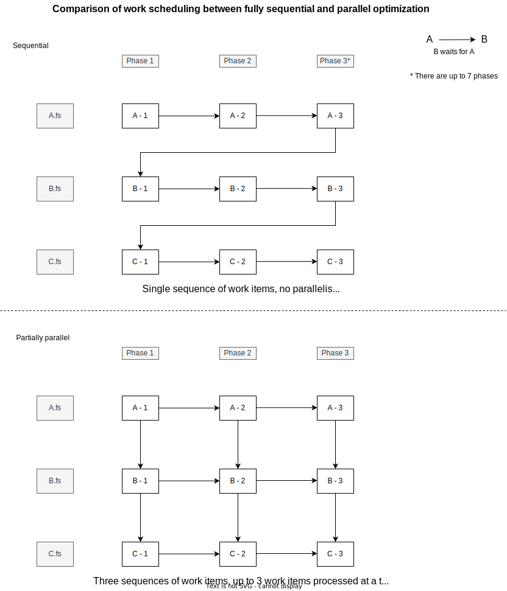

# Parallel Optimizations

The Optimization phase of standalone compilation can take a significant part of compilation time.

By default it runs fully sequentially, file-by-file.

However, optimization of each file can be decomposed into up to 7 distinct 'phases',
with the interesting property that evaluating phase P of file F does not depend on results of phases P+1... for any of the preceding files.

This allows us to parallelize the whole process as shown in the diagram below:

This parallelization is implemented in `OptimizeInputs.fs`.
It can enabled with an experimental flag `--test:ParallelOptimization`.