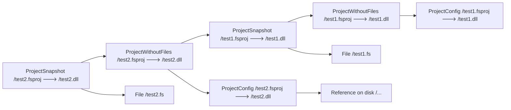

```mermaid

graph LR

1[ProjectWithoutFiles /test1.fsproj 🡒 /test1.dll] --> 0[ProjectConfig /test1.fsproj 🡒 /test1.dll]
3[ProjectSnapshot /test1.fsproj 🡒 /test1.dll] --> 1[ProjectWithoutFiles /test1.fsproj 🡒 /test1.dll]
3[ProjectSnapshot /test1.fsproj 🡒 /test1.dll] --> 2[File /test1.fs]
5[ProjectConfig /test2.fsproj 🡒 /test2.dll] --> 4[Reference on disk /...]
6[ProjectWithoutFiles /test2.fsproj 🡒 /test2.dll] --> 5[ProjectConfig /test2.fsproj 🡒 /test2.dll]
6[ProjectWithoutFiles /test2.fsproj 🡒 /test2.dll] --> 3[ProjectSnapshot /test1.fsproj 🡒 /test1.dll]
8[ProjectSnapshot /test2.fsproj 🡒 /test2.dll] --> 6[ProjectWithoutFiles /test2.fsproj 🡒 /test2.dll]
8[ProjectSnapshot /test2.fsproj 🡒 /test2.dll] --> 7[File /test2.fs]

```