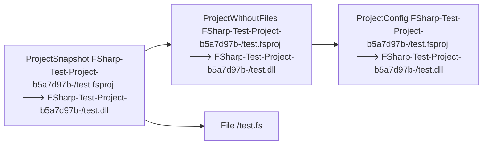

```mermaid

graph LR

1[ProjectWithoutFiles FSharp-Test-Project-b5a7d97b-/test.fsproj 🡒 FSharp-Test-Project-b5a7d97b-/test.dll] --> 0[ProjectConfig FSharp-Test-Project-b5a7d97b-/test.fsproj 🡒 FSharp-Test-Project-b5a7d97b-/test.dll]
3[ProjectSnapshot FSharp-Test-Project-b5a7d97b-/test.fsproj 🡒 FSharp-Test-Project-b5a7d97b-/test.dll] --> 1[ProjectWithoutFiles FSharp-Test-Project-b5a7d97b-/test.fsproj 🡒 FSharp-Test-Project-b5a7d97b-/test.dll]
3[ProjectSnapshot FSharp-Test-Project-b5a7d97b-/test.fsproj 🡒 FSharp-Test-Project-b5a7d97b-/test.dll] --> 2[File /test.fs]

```