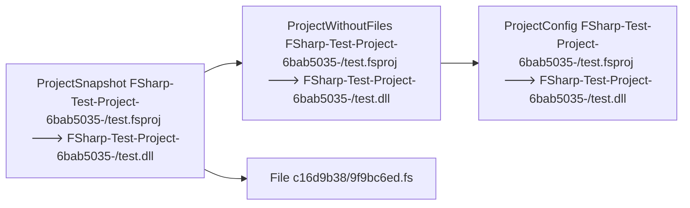

```mermaid

graph LR

1[ProjectWithoutFiles FSharp-Test-Project-6bab5035-/test.fsproj 🡒 FSharp-Test-Project-6bab5035-/test.dll] --> 0[ProjectConfig FSharp-Test-Project-6bab5035-/test.fsproj 🡒 FSharp-Test-Project-6bab5035-/test.dll]
3[ProjectSnapshot FSharp-Test-Project-6bab5035-/test.fsproj 🡒 FSharp-Test-Project-6bab5035-/test.dll] --> 1[ProjectWithoutFiles FSharp-Test-Project-6bab5035-/test.fsproj 🡒 FSharp-Test-Project-6bab5035-/test.dll]
3[ProjectSnapshot FSharp-Test-Project-6bab5035-/test.fsproj 🡒 FSharp-Test-Project-6bab5035-/test.dll] --> 2[File c16d9b38/9f9bc6ed.fs]

```