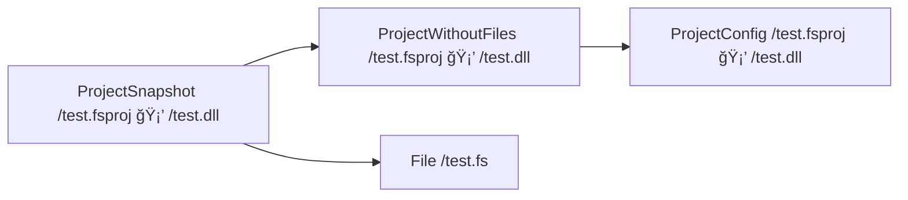

```mermaid

graph LR

1[ProjectWithoutFiles /test.fsproj 🡒 /test.dll] --> 0[ProjectConfig /test.fsproj 🡒 /test.dll]
3[ProjectSnapshot /test.fsproj 🡒 /test.dll] --> 1[ProjectWithoutFiles /test.fsproj 🡒 /test.dll]
3[ProjectSnapshot /test.fsproj 🡒 /test.dll] --> 2[File /test.fs]

```