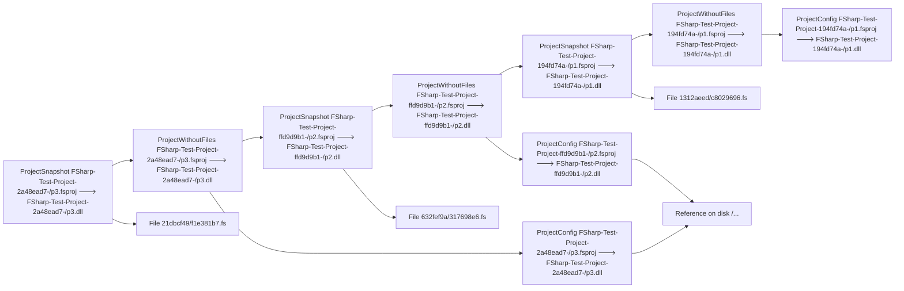

```mermaid

graph LR

1[ProjectWithoutFiles FSharp-Test-Project-194fd74a-/p1.fsproj 🡒 FSharp-Test-Project-194fd74a-/p1.dll] --> 0[ProjectConfig FSharp-Test-Project-194fd74a-/p1.fsproj 🡒 FSharp-Test-Project-194fd74a-/p1.dll]
3[ProjectSnapshot FSharp-Test-Project-194fd74a-/p1.fsproj 🡒 FSharp-Test-Project-194fd74a-/p1.dll] --> 1[ProjectWithoutFiles FSharp-Test-Project-194fd74a-/p1.fsproj 🡒 FSharp-Test-Project-194fd74a-/p1.dll]
3[ProjectSnapshot FSharp-Test-Project-194fd74a-/p1.fsproj 🡒 FSharp-Test-Project-194fd74a-/p1.dll] --> 2[File 1312aeed/c8029696.fs]
5[ProjectConfig FSharp-Test-Project-ffd9d9b1-/p2.fsproj 🡒 FSharp-Test-Project-ffd9d9b1-/p2.dll] --> 4[Reference on disk /...]
6[ProjectWithoutFiles FSharp-Test-Project-ffd9d9b1-/p2.fsproj 🡒 FSharp-Test-Project-ffd9d9b1-/p2.dll] --> 5[ProjectConfig FSharp-Test-Project-ffd9d9b1-/p2.fsproj 🡒 FSharp-Test-Project-ffd9d9b1-/p2.dll]
6[ProjectWithoutFiles FSharp-Test-Project-ffd9d9b1-/p2.fsproj 🡒 FSharp-Test-Project-ffd9d9b1-/p2.dll] --> 3[ProjectSnapshot FSharp-Test-Project-194fd74a-/p1.fsproj 🡒 FSharp-Test-Project-194fd74a-/p1.dll]
8[ProjectSnapshot FSharp-Test-Project-ffd9d9b1-/p2.fsproj 🡒 FSharp-Test-Project-ffd9d9b1-/p2.dll] --> 6[ProjectWithoutFiles FSharp-Test-Project-ffd9d9b1-/p2.fsproj 🡒 FSharp-Test-Project-ffd9d9b1-/p2.dll]
8[ProjectSnapshot FSharp-Test-Project-ffd9d9b1-/p2.fsproj 🡒 FSharp-Test-Project-ffd9d9b1-/p2.dll] --> 7[File 632fef9a/317698e6.fs]
9[ProjectConfig FSharp-Test-Project-2a48ead7-/p3.fsproj 🡒 FSharp-Test-Project-2a48ead7-/p3.dll] --> 4[Reference on disk /...]
10[ProjectWithoutFiles FSharp-Test-Project-2a48ead7-/p3.fsproj 🡒 FSharp-Test-Project-2a48ead7-/p3.dll] --> 9[ProjectConfig FSharp-Test-Project-2a48ead7-/p3.fsproj 🡒 FSharp-Test-Project-2a48ead7-/p3.dll]
10[ProjectWithoutFiles FSharp-Test-Project-2a48ead7-/p3.fsproj 🡒 FSharp-Test-Project-2a48ead7-/p3.dll] --> 8[ProjectSnapshot FSharp-Test-Project-ffd9d9b1-/p2.fsproj 🡒 FSharp-Test-Project-ffd9d9b1-/p2.dll]
12[ProjectSnapshot FSharp-Test-Project-2a48ead7-/p3.fsproj 🡒 FSharp-Test-Project-2a48ead7-/p3.dll] --> 10[ProjectWithoutFiles FSharp-Test-Project-2a48ead7-/p3.fsproj 🡒 FSharp-Test-Project-2a48ead7-/p3.dll]
12[ProjectSnapshot FSharp-Test-Project-2a48ead7-/p3.fsproj 🡒 FSharp-Test-Project-2a48ead7-/p3.dll] --> 11[File 21dbcf49/f1e381b7.fs]

```