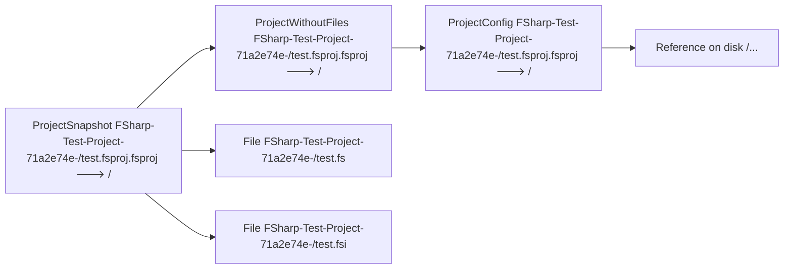

```mermaid

graph LR

1[ProjectConfig FSharp-Test-Project-71a2e74e-/test.fsproj.fsproj 🡒 /] --> 0[Reference on disk /...]
2[ProjectWithoutFiles FSharp-Test-Project-71a2e74e-/test.fsproj.fsproj 🡒 /] --> 1[ProjectConfig FSharp-Test-Project-71a2e74e-/test.fsproj.fsproj 🡒 /]
4[ProjectSnapshot FSharp-Test-Project-71a2e74e-/test.fsproj.fsproj 🡒 /] --> 2[ProjectWithoutFiles FSharp-Test-Project-71a2e74e-/test.fsproj.fsproj 🡒 /]
4[ProjectSnapshot FSharp-Test-Project-71a2e74e-/test.fsproj.fsproj 🡒 /] --> 5[File FSharp-Test-Project-71a2e74e-/test.fsi]
4[ProjectSnapshot FSharp-Test-Project-71a2e74e-/test.fsproj.fsproj 🡒 /] --> 3[File FSharp-Test-Project-71a2e74e-/test.fs]

```