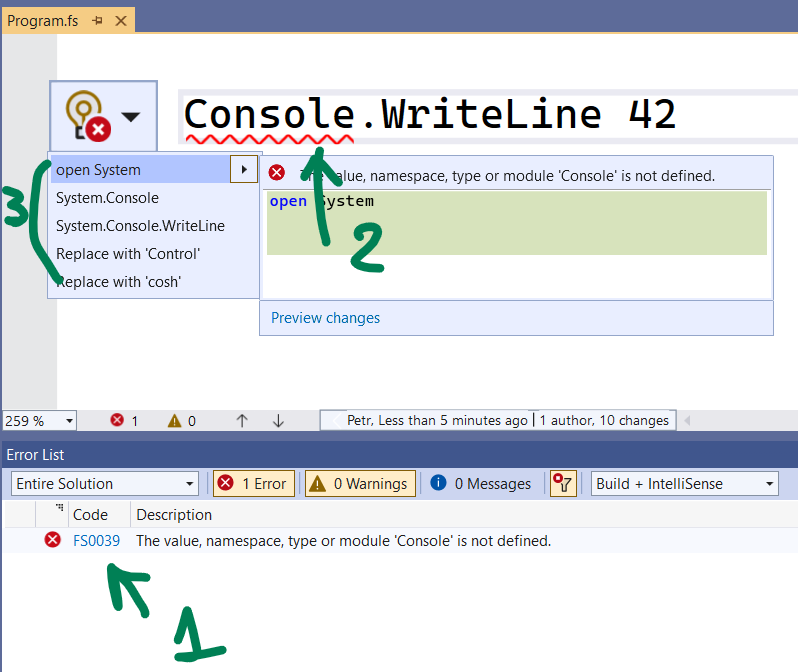
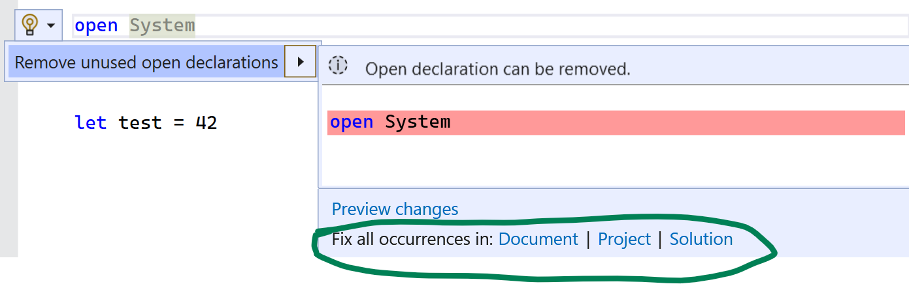

# Code Fixes In F#

Code fixes are suggestions provided by IDEs to automatically address coding issues. In Visual Studio, they fall under the category of [Quick Actions](https://learn.microsoft.com/visualstudio/ide/quick-actions) and are displayed within the light bulb icon menu.

## Quick Facts

1. Code fixes are triggered by one or more [diagnostics](https://github.com/dotnet/fsharp/blob/main/docs/diagnostics.md) (e.g., FS0039 and/or IDE0005).
1. If there are multiple diagnostics, they are guaranteed to share the same _span_ (the red squiggly).
1. Every code fix can produce:
  - No suggestions (got triggered but couldn't come up with a suitable suggestion for a fix).
  - One suggestion (e.g., "Discard unused value").
  - Multiple suggestions (e.g., "Open namespace X" or "Fully qualify namespace X").

_Bulk code fixes_ perform the same actions for identical diagnostics across a document/project/solution:

## Technical Implementation

- Code fixes need to adhere to certain Visual Studio API requirements:
  - Have the `[<ExportCodeFixProvider>]` attribute.
  - Inherit from the `CodeFixProvider` class.
- When inheriting `CodeFixProvider`, a few members should be overridden:
  - `FixableDiagnosticIds` - lists all diagnostics triggering the code fix.
  - `RegisterCodeFixesAsync` - has the primary code fix logic.
  - `GetFixAllProvider` - needed for those with bulk behavior.
- On top of that, we have our own framework for F# code fixes, found in the `IFSharpCodeFix.fs` file. In that regard, code fixes should implement one of:
  - The `IFSharpCodeFixProvider` interface - for those generating at most one suggestion (the majority).
  - The `IFSharpMultiCodeFixProvider` interface - for those able to produce several suggestions.
- Code fixes within the above framework can and should be unit tested.

## Improving Existing Code Fixes

1. Find the corresponding unit test suite.
2. Introduce a test featuring the code with the diagnostic alongside the expected code fix behavior (0, 1, or multiple suggestions).
3. Adopt a TDD approach and modify the code fix logic. Keep in mind that occasionally, issues might originate in the compiler layer.

## Creating New Code Fixes

1. Create a matching unit test suite with both positive and negative cases.
2. Seek a similar code fix for inspiration.
3. Craft your new code fix, ensuring compliance with the framework described above.
4. Just before submitting the code fix, manually double-check that it works in VS - demo videos are welcome. 

## Useful Links:

1. [Code fix tracking issue](https://github.com/dotnet/fsharp/issues/15408) - tracks bugs, enhancements, and suggestions for new code fixes.
2. [A session from Amplifying F#](https://amplifying-fsharp.github.io/sessions/2023/06/16/) that largely focuses on crafting code fixes.